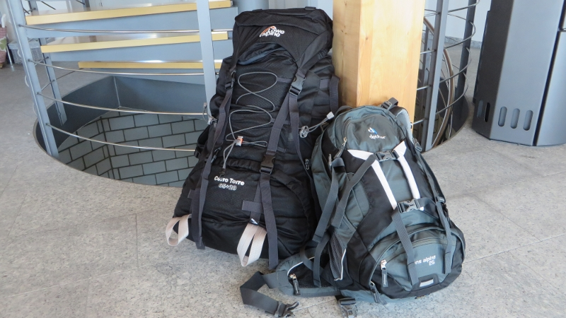
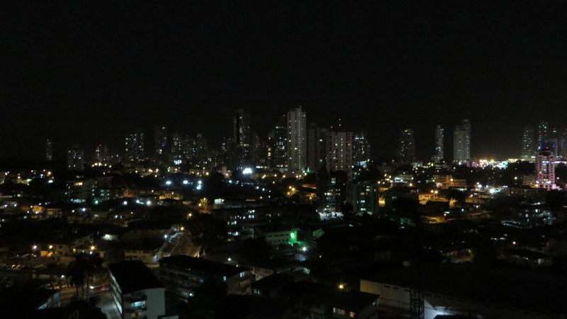

Nach jahrelangem Träumen und mehreren Wochen Vorfreude / Vorbereitung ging plötzlich alles ganz schnell: Der letzte
Arbeitstag war passé, das Auto verkauft, die Wohnung abgegeben, die *Mochila* (spanisch für Rucksack) gepackt, die
restlichen Habseligkeiten in Cartons verstaut, Freunde und Bekannte umarmt und ich sass in einem Flugzeug nach Panamà.

<figcaption>Das Gepäck ist bereit</figcaption>

Dort komme ich nach geschätzten hundert Stunden Flugzeit dann auch an. Der erste Eindruck: Es ist heiss und extrem
feucht. Die Taxifahrt vom [Aeropuerto Internacional de Tocumen](http://www.tocumenpanama.aero/) in die Stadt ist nichts
für schwache Nerven: Auf der
zweispurigen Schnellstrasse schlängeln sich die Autos in bis zu vier Spuren durch den frühmorgendlichen Pendlerverkehr -
die Sicherheitslinien interessieren offenbar niemanden. Es wird gehupt und geflucht, ab und zu eilt auch ein Fussgänger
über die Schnellstrasse. Verbindliche Vortrittsregeln gibts hier scheinbar nicht, wie auch die Stossstangen der Autos
vermuten lassen.

<figcaption>Aussicht vom Appartment: Panamà bei Nacht</figcaption>

Nach diesem einstündigen Nerventest erreiche ich meine Unterkunft: Die ersten paar Tage übernachte ich bei
[Steve](https://www.airbnb.com/users/show/2406450), einem
Belgier, der vor einigen Jahren nach Panamà ausgewandert ist und in Panamàs Altstadt ein Restaurant führt. Steve wohnt
in einem 20-stöckigen Hochhaus mit Blick auf die Skyline Panamàs. Alle Bewohner des Hochhauses (und zu meinem Glück:
auch deren Gäste) erhalten Zugang zum hauseigenen Pool. Nach einer kurzen Führung durch die Wohnung gehts dann prompt ab
an den Pool, wo ich mich für den Rest des Tages von den Reisestrapazen erhole. Da ich die Zeitumstellung (Schweizer Zeit
minus 7 Stunden) noch nicht ganz überwunden habe, begebe ich mich früh ins (glücklicherweise klimatisierte) Schlafzimmer
und schlafe sofort ein...
