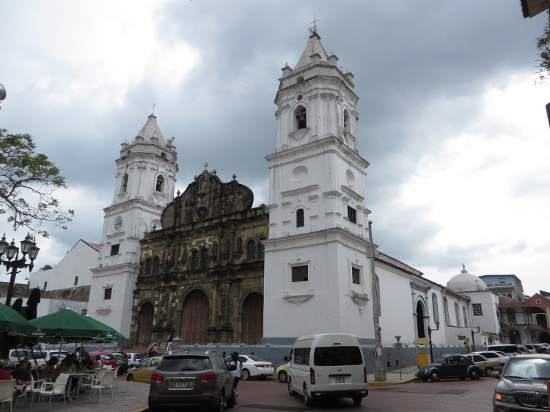
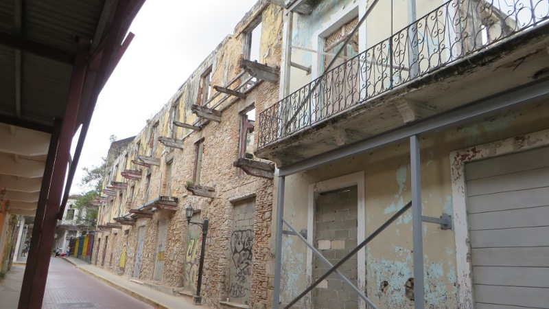
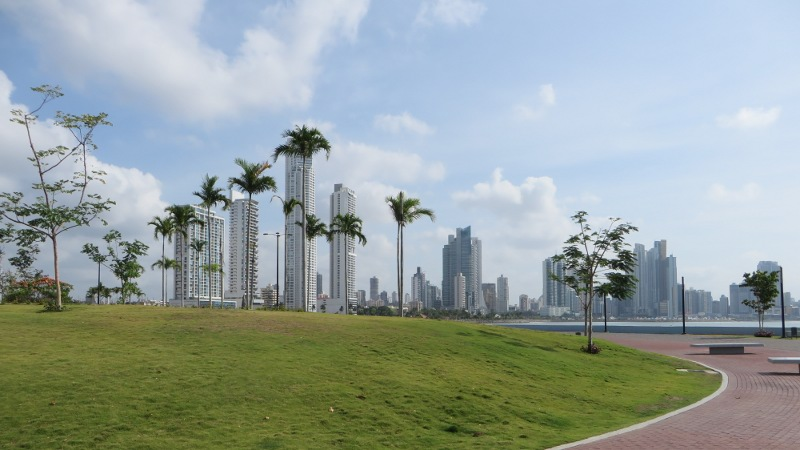
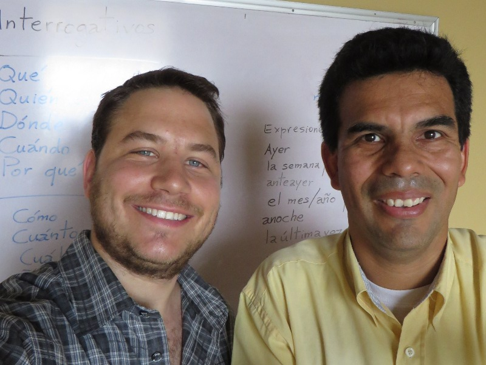
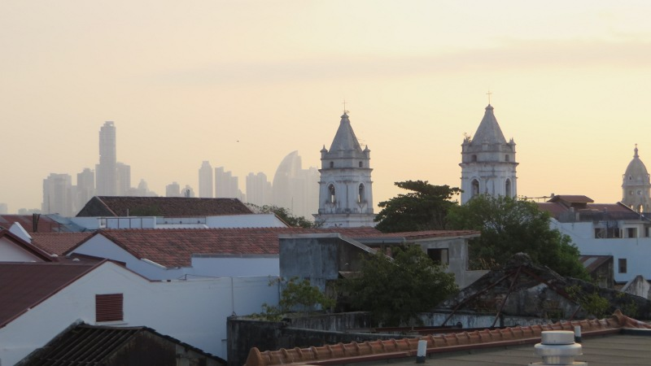

Mittlerweile bin ich seit fast zwei Wochen in Panamà und habe mich einigermassen mit der Hitze arrangiert. Der Trick ist,
sich möglichst langsam zu bewegen und sich jeweils einen Platz möglichst nahe am Ventilator zu suchen (falls es denn einen
gibt). Vor ein paar Tagen bin ich nach *Casco Viejo*, Panamàs Altstadtquartier umgezogen.

<figcaption>Kathedrale von Casco Viejo</figcaption>

Casco Viejo befindet sich auf einer Halbinsel und wurde von den Spaniern erbaut, als die originale Stadt einem Freibeutertrupp
um [Henry Morgan](http://de.wikipedia.org/wiki/Henry_Morgan) zum Opfer fiel. Das war vor 350 Jahren. Heute ist Casco Viejo
[Unesco Weltkulturerbe](http://whc.unesco.org/en/list/790) und würde optisch geradesogut an die Küste Spaniens passen.
Da der Stadtteil und dessen Häuser nicht massgeblich verändert werden dürfen, finden sich hier viele Häuser, die innen
zusammengefallen sind und nur noch aus den Aussenmauern bestehen. Inmitten dieses mediterran anmutenden Städtchens findet
sich das [Hostel Panamericana](http://www.panamericanahostel.com/), in dem ich für zwei Wochen ein Bett in einem
Zwölferschlag besetze. Glücklicherweise befindet sich dieses nahe am Ventilator; man lernt ja schnell.

<figcaption>Ruinen in Casco Viejo</figcaption>

Da ich an diesem morgen bereits früh aufwache, gehe ich joggen. Zwischen Casco Viejo und dem
Stadtkern Panamàs befindet sich direkt am Pazifik ein wundervolles Boulevard, die *Cinta Costera*. Meine
Trainingseinheiten beschränken sich allerdings auf die Tage, in denen ich zwischen 6 und 7 Uhr morgens aus dem Bett
komme, denn ab 8 Uhr will in Panamà wegen der Hitze jede Bewegung wohlüberlegt sein.

<figcaption>Cinta Costera</figcaption>

Nach dem Jogging bin ich klatschnass, denn auch wenn die Temperatur frühmorgens auf kühle 25 Grad Celsius sinkt, ist die
Luftfeuchtigkeit extrem hoch. Es geht ab unter die kühlende Dusche und danach gönne ich mir eine *piña* (spanisch für
Ananas) zum Frühstück. Diese ist so süss, dass ich glauben würde, etwas Künstliches zu essen, wenn ich sie nicht gerade
erst bei einem Strassenhändler gekauft und selber geschält hätte. Der Preis pro Stück beläuft sich übrigens auf
umgerechnet 30-50 Rappen.

Den Rest des Morgens verbringe ich mit dem Schreiben von E-Mails und dem Planen von zukünftigen Abenteuern: Dazu tausche
ich mich oft mit anderen *Mochileros* (spanisch für Rucksacktouristen) aus, die Mittel- und Südamerika in umgekehrter
Richtung bereisen.

Zum Mittagessen gehts ab in ein lokales Restaurant. Es gibt wahlweise Reis mit Poulet, Reis mit
Fisch, Reis mit Tintenfisch, Reis mit Linsen oder Reis mit allem. Ich entscheide mich heute mal für Reis (mit
Tintenschfisch). Ich esse schnell, denn um 13:00 Uhr beginnt schon der Spanischunterricht mit dem ich mich auf den Rest
der Reise vorbereiten will. Zusammen mit Marie-Laure aus Frankreich und Matt aus England führe ich den ganzen Nachmittag
tiefgründige Diskussionen über das Wetter, konjugiere Verben und versuche den Unterschied zwischen *ser* und *estar*,
den beiden spanischen Wörtern für *sein* zu verstehen. Wenn uns unser Lehrer Adolfo in die Pause entlässt, schauen wir zu,
wie sich der Pazifik das an die Ebbe verlorene Land zurückholt.

<figcaption>Spanischlehrer Adolfo und meine Wenigkeit</figcaption>

Der Unterricht endet um 17:00 Uhr. Ich flaniere ein bisschen durch das Viertel und lasse mich dann auf der *Plaza de la
Independencia* nieder, um ein paar Seiten zu lesen. Bald gehts zurück ins Hostel, wo ich mich fürs Abendessen frisch
mache. Frisch machen heisst: Das Gesicht trocknen und ein bisschen Deo nachsprühen - Ein frisches Shirt liegt leider
nur alle paar Tage drin.

Mit zwei Zimmerkollegen besuche ich den Fischmarkt, wo sich bereits zahlreiche Einheimische vor kleinen, improvisierten
Fischrestaurants niedergelassen haben. Wir bestellen [Ceviche](http://de.wikipedia.org/wiki/Ceviche). Dieses ursprünglich
aus Peru stammende Gericht besteht aus kleingeschnittenem rohem Fisch, der in Limettensaft und Zwiebeln eingelegt wird.
Dazu gibts Brot und Bier. Das Ganze schmeckt köstlich und kostet dreimal nichts.

<figcaption>Aussicht von der Dachterrasse des Hostels</figcaption>

Zurück im Hostel treffen wir uns mit anderen Reisenden auf der Dachterrasse und geniessen bei einem Bier die Aussicht auf
die Skyline Panamàs. Es ist faszinierend, wieviele interessante Leute man hier trifft: Da ist zum Beispiel Kyle, der
Amerikaner, der auf dem Einrad von Washington D.C. hierher gefahren ist und dem nur noch 30 Kilometer für den Weltrekord im
*long distance unicycling* fehlen. Oder Thomas, Studienabgänger aus Paris, der hier einen Job als Architekt gefunden hat und
spontan ausgewandert ist. Ausserdem ist da noch Kenneth, der Schwede, der von Alaska nach Brasilien radelt, um als Wikinger
verkleidet der Fussballweltmeisterschaft beizuwohnen. Dass sich Schweden nicht für die WM qualifiziert habe, sei ja
nicht sein Problem, erklärt er mit einem Lächeln auf den Stockzähnen. Auf dem Dach finden sich auch fast immer ein
Gittarrenspieler und einige Sänger, wobei nicht alle auf gleichviel Talent zurückgreifen können. Aber wie sagte bereits
[Henry van Dyke](http://en.wikipedia.org/wiki/Henry_van_Dyke)? „*Die Wälder wären sehr still, wenn nur die begabtesten
Vögel sängen*“. Daran denke ich, als ich müde in mein Bett neben dem Ventilator sinke und schnell einschlafe...
