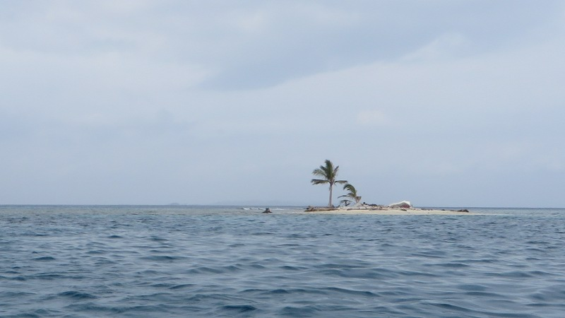
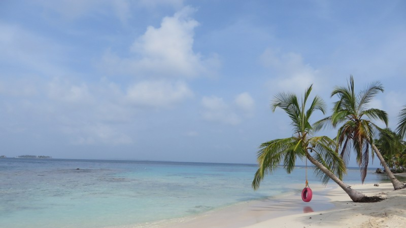
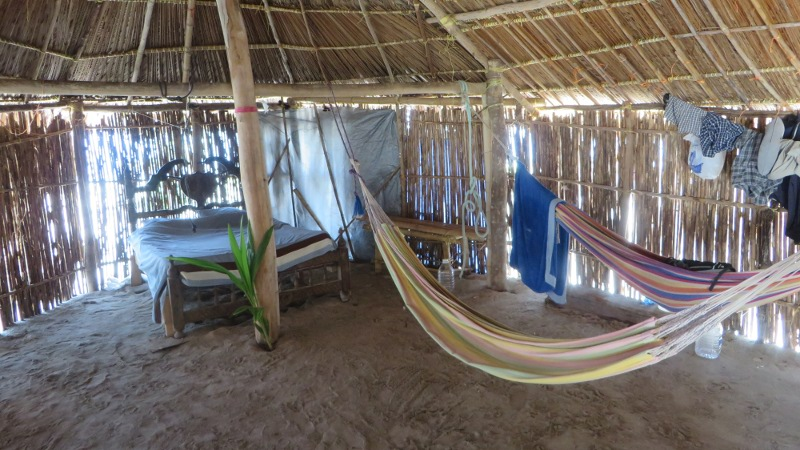
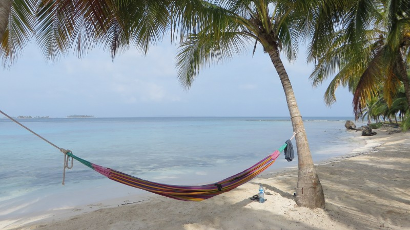
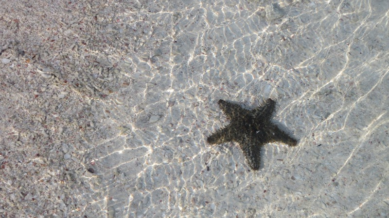

Um 5:00 Uhr morgens werde ich jäh aus dem Schlaf gerissen. Ich höre ein Geräusch, das ich seit längerer Zeit nicht mehr gehört
habe: Das Klingeln meines Weckers. Ächzend zwinge ich mich aus dem Bett - Schliesslich will ich ja bereit sein, wenn
mich der Shuttle in zwanzig Minuten abholt, um mich zusammen mit einer handvoll anderen *Mochileros* nach *San Blas* zu
bringen.

San Blas (oder *Guna Yala* in der Sprache der Einheimischen) ist ein aus 365 Inseln bestehender Archipel im Nordosten
von Panama. Die Inselgruppe ist ein autonomes Gebiet Panamas und wird seit etwa 80 Jahren von den einheimischen
[Kuna](http://de.wikipedia.org/wiki/Kuna_(Ethnie))-Indianern selbständig verwaltet.

Als der 4x4-Shuttle mit ungefähr 40 Minuten Verspätung (in Panama ist immer alles ein bisschen später und teurer als
ursprünglich abgemacht) losfährt, bin ich noch nicht ganz wach. Das macht aber nichts, denn vorerst steht die Fahrt
von Panama City nach San Blas an. Nach einer Stunde Schnellstrasse gehts zwei Stunden durch den Dschungel, bis wir einen
kleinen Hafen an einem Fluss mitten im Dickicht erreichen.

<figcaption>Einsame Insel auf San Blas</figcaption>

Nach einigen Verhandlungen und dem schon fast traditionellen Warten gehts mit einem Motorboot weiter. Wir folgen dem
Fluss, der auch ein Nebenfluss des Amazonas sein könnte, durch den Dschungel Richtung Meer. Als wir dieses erreichen,
beginnt es wie aus Kübeln zu giessen. Die durch den starken Wellengang auf- und abwippende Nussschale trägt den Rest
dazu bei, dass wir innerhalb weniger Minuten alle klatschnass sind. Ich lege die Dusche als wohltuende Abkühlung ab und
blicke gespannt aufs vor uns liegende karibische Meer. Mein Zweckoptimismus ist nicht lange vonnöten, denn der Regen
stoppt just in dem Moment, als vor uns die ersten Inseln auftauchen. Einige der Inseln sind kaum gross genug um ein Haus
draufzustellen, aber mindestens eine Palme gehört hier zu jedem Eiland dazu.

<figcaption>Traumhafte Aussicht: Sandstrand und Palmen</figcaption>

Als wir einige Minuten später unsere Zielinsel erreichen, bleibt mir fast der Atem Weg: Vor mir liegt ein von
Kokospalmen gesäumter weisser Sandstrand, hie und da findet sich ein Seestern. In
[Jack-Sparrow](http://de.wikipedia.org/wiki/Jack_Sparrow#Johnny_Depp_als_Darsteller_Captain_Jack_Sparrows)-Manier
blicke ich zufrieden auf das hellblaue Wasser hinaus - Die Bilder hatten nicht gelogen, ich befinde mich im Paradies.
Bevor ich einen Piratengesang anstimmen kann (was wahrscheinlich besser ist) werde ich von einem Einheimischen
Kuna begrüsst: *Nuve Gambi* (Kuna für Hallo). Er fragt nach meinem Namen, warnt mich vor herabfallenden Kokosnüssen
(jährlich sterben mehr Menschen an herabfallenden Kokosnüssen als an Haifischattacken) und zeigt mir meine Unterkunft,
eine Bambushütte mit Hängematten. Die Stimmung ist sehr persönlich, man kennt sich beim Namen und für einen halben Tag
bin ich sogar der einzige Nicht-Kuna auf der Insel.

<figcaption>Meine Unterkunft auf der Insel</figcaption>

Nachdem ich mein Gepäck in der Hütte verstaut habe, gehts ans Erkunden des Eilands (eine Umrundung dauert ca. 15 Minuten).
Auf der anderen Seite der Insel treffe ich einen weiteren Einheimischen, einen älteren Mann, der mir etwa bis zur
Schulter reicht (mit 1.65m bin ich hier so etwas wie ein Hüne). Während er mir eine Kokosnuss zum Trinken aufschlägt,
erzählt er mir, dass die Kuna noch heute vor allem vom Fischfang und vom Kokosnussexport leben. Er erklärt mir ausserdem,
dass seine Familie nur noch ein paar Wochen auf dieser Insel bleiben wird, denn alle fünf Monate wird den Familien vom
Kongress der Kuna eine neue Insel zugeteilt. Privatgrundstücke gibt es auf San Blas nicht und so wird sichergestellt,
dass alle Familien gleichermassen von den schönen und ergiebigen Inseln profitieren können.

Unser Gespräch gerät etwas ins Stocken, denn Spanisch ist auch für ihn eine Fremdsprache. Das macht aber nichts, denn in
diesem Moment signalisiert das Familienoberhaupt durch Schlagen des Kochlöffels auf eine Pfanne, dass das Mittagessen
bereitsteht. Es gibt Reis mit frisch gefangenem Fisch - Köstlich.

<figcaption>Hängematte am Strand: So lässt's sich leben</figcaption>

Am Nachmittag schwimme ich zum Schnorcheln zur Nachbarinsel, denn dort ist vor vielen Jahren ein etwa zwanzig Meter
langes Schiff gesunken. Mittlerweile haben sich an den Überresten des Schiffs farbenvolle Korallen niedergelassen und
bieten einen überwältigenden Anblick. Zwischen den Korallen schwimmen Fische in allen Formen und Farben, einige
leuchten sogar (!). Ich schwimme durch einen riesigen Schwarm, der wohl tausende von Fischen umfasst und erblicke ein
Wesen, das wie ein farbiger Unterwassertausendfüssler aussieht - Faszinierend, was für eine Welt sich unter der
Wasseroberfläche versteckt hält. Ich würde die Wesen wahrscheinlich noch stundenlang beobachten, doch ein Schwarm von
Quallen überzeugt mich sanft, zur Hauptinsel zurückzukehren.

<figcaption>Seesterne existieren also tatsächlich</figcaption>

Nach dem Abendessen treffe ich einen alten Seebären, der sein Segelschiff vor der Insel geankert hat. Bei einem Glas
Rum (man ist ja in der Karibik) erzählt er Seefahrergeschichten, zum Beispiel wie er mal à la
[All is Lost](http://de.wikipedia.org/wiki/All_Is_Lost) auf offener See einen Schiffscontainer gerammt hat. Als sich die
Rumflasche dem Ende neigt, lädt er mich zum *Caffi mache* auf sein Schiff ein, denn es sind noch lange nicht alle
Seefahrergeschichten erzählt. Mit Sprüchen wie „*If you didn't grow up by the age of fifty, you don't have to*“ sorgt
der Kanadier für einen mehr als unterhaltsamen Abend. Trotzdem ist natürlich jeder Abend mal zu Ende und es geht zurück
auf die Insel, wo ich müde und zufrieden in meine Hängematte sinke...
