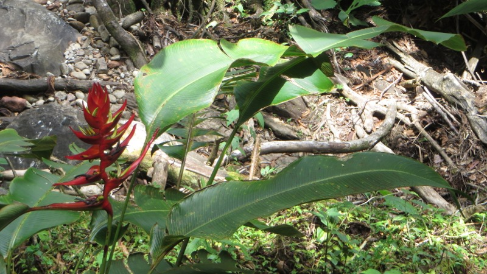

<figcaption>Regenwald in Chiriquí</figcaption>

Ich sitze in einem *Colectivo* (so werden die privaten Kleinbusse genannt, die sich die Leute in Panamà teilen um
voranzukommen) von David Richtung Norden. Die Fahrt ist ein Erlebnis für sich: Als einziger Weisser sitze ich in einer
bunten Mischung von Leuten (ungefähr doppelt so viele, wie's Sitze gibt), Gepäck, Einkäufen (darunter ein
Flachbildschirm) und einer Kiste mit Post. Das Ganze wird untermalt mit rassiger Salsamusik, die perfekt zum Fahrstil
des Chauffeurs passt. In diesem Bus sitze ich also und denke an die Erlebnisse der vergangenen Tage.

<figcaption>Wilde Blume im Urwald</figcaption>

Letzte Woche hatte ich Panamà-City über die [Puente de las Américas](http://de.wikipedia.org/wiki/Puente_de_las_Am%C3%A9ricas),
die Brücke, welche die beiden amerikanischen Kontinente miteinander verbindet, verlassen. Sieben Stunden Busfahrt brachten
mich in die Provinz Chiriquí im Westen von Panamà. Die Panameños neigen übrigens zu einem exzessiven Einsatz von
Klimaanlagen in Bussen / Taxis, weshalb mich die Busfahrt in den bizarren Genuss einer Erkältung (ich befinde mich notabene
in den Tropen!) gebracht hat. Das Bergdorf Boquete in Chiriquí ist ein krasser Gegensatz zu den weissen Stränden von [San
Blas](/blog/20140503_guna_yala): Am Fusse des Vulkans [Barú](http://en.wikipedia.org/wiki/Volc%C3%A1n_Bar%C3%BA), dem
höchsten Berg von Panamà, ist die Temperatur kühl - zum ersten Mal war ich froh, einen Pullover eingepackt zu haben.
Die Landschaft ist geprägt von mit Dickicht überwucherten Hügeln und Bergen, die von allerlei kuriosen Pflanzen, Vögeln
und Insekten (darunter goldige Käfer!) bewohnt werden.

<figcaption>20cm grosser Riesenkäfer, der einen menschlichen Finger abbeissen kann</figcaption>

Von Boquete aus hatte ich zahlreiche Ausflüge in den Regenwald unternommen um diesen auf Wandertouren zu erkunden,
versteckte Wasserfälle zu entdecken, in heissen Quellen zu baden und von den Mango- und Zitrusfruchtbäumen zu naschen,
die dort wie Unkraut aus dem Boden schiessen. Ein besonders lehrreicher Ausflug war die Besichtigung einer
Bio-Kaffeeplantage im Hochland um Boquete. Da wurde mir erklärt, wie Anbau und Ernte ablaufen, wie die aus alten
Autoteilen zusammengebaute Schälmaschine funktioniert, wie Bitterstoffe in den Kaffee gelangen und dass starker Kaffee
nicht zwingend bitter sein muss. Zum Beweis dieser Behauptung wurde natürlich auch gleich eine Tasse des hauseigenen
Kaffees serviert. Ich war entzückt: Der Kaffee schmeckte köstlich und enthielt tatsächlich keine Bitterstoffe. Im Shop,
in dem das Kilo Edelkaffee für 300.- Dollar verkauft wird, konnte ich mich jedoch glücklicherweise zurückhalten.

<figcaption>Frisch geröstete Kaffeebohnen</figcaption>

Ich unterbreche meine Gedanken, denn der Colectivo hat mein Ziel erreicht: Mitten im Regenwald zwischen David und
Changuinola steht das Hostel [Lost & Found](http://www.lostandfoundlodge.com/), das ich für ein paar Tage bewohnen werde.
Ich bitte den Chauffeur anzuhalten (eine Haltestelle gibt es hier nicht) und steige aus.
Zugegeben, ein bisschen mulmig ist mir schon, als der Kleinbus davonfährt und ich mit meinem Rucksack alleine am
Strassenrand im Urwald stehe. Allerdings bleibt mir ja nichts anderes übrig, als dem Pfad in den Wald zu folgen und zu hoffen,
am richtigen Ort ausgestiegen zu sein. Ich schleppe meinen Rucksack durch den Dschungelpfad (hätte ich nur noch ein Paar
Socken weniger eingepackt!) und nach zwanzig Minuten erreiche ich schweissüberströmt die Unterkunft. Auf einer Lichtung
befindet sich eine Sammlung von einigen selbst zusammengezimmerten Hütten: Schlafhaus, Toilettenhaus, Gemeinschaftsraum
und sogar eine kleine Bar. Schnell bin ich den ungefähr zehn Bewohnern des Camps (und dem verspielten
[Wickelbären](http://de.wikipedia.org/wiki/Wickelb%C3%A4r) Rocky) vorgestellt.

<figcaption>Wasserfall in Boquete</figcaption>

Das Hostel bietet unter anderem den Traum eines jeden Kindgebliebenen an: Eine Schatzsuche quer durch den Urwald. Schnell
findet sich eine Gruppe von mutigen Hostelgästen, die das Abenteuer annehmen. Ausgerüstet mit Schatzkarte, Proviant und
Insektenspray machen wir uns auf den Weg in das Dickicht. In [Indiana-Jones](http://de.wikipedia.org/wiki/Indiana_Jones)-Manier
suchen wir unseren Weg durch den Wald. Bald finden wir in einem zweihundert Jahre alten Baum den ersten Hinweis:
Ein kniffliges Rätsel, das uns den Fundort des nächsten Hinweises prophezeit. Gemeinsam können wir das Rätsel lösen und so
gehn wir weiter zwischen Lianen und Orangenbäumen, überqueren Flüsse, steigen Hügel hoch und wieder runter, immer auf
der Suche nach dem nächsten Hinweis. In der Höhle an der Quelle eines Flusses finden wir das alte Geheimnis der
Ureinwohner dieses Waldes. Dieses ist zwar leider nicht ein Goldschatz, sondern lediglich eine Geschichte um einen
Goldschatz, aber gelohnt hat sich die Schatzsuche ohnehin. Zurück im Hostel erhalten wir als Belohnung für das Lüften
des Geheimnisses allerdings ein kühles Bier, was in diesem Moment mehr wert ist, als jeder Goldschatz.

<figcaption>Wilde Blumen</figcaption>

An diesem Abend lerne ich in der Praxis, warum es Regenwald heisst, denn es beginnt in Strömen zu schütten. Ich bin froh,
dass wir rechtzeitig zum Hostel zurückgekehrt sind und lausche zufrieden den vom Regen unternmalten Gitarrenklängen:
Auch hier im Dschungel findet sich ein begnadeter Musiker unter den Gästen...

<figcaption>Aussicht vom Lost & Found Hostel</figcaption>
