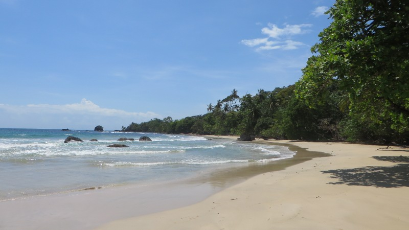
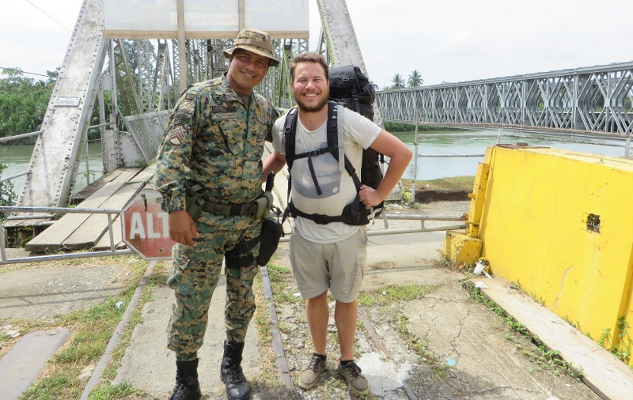
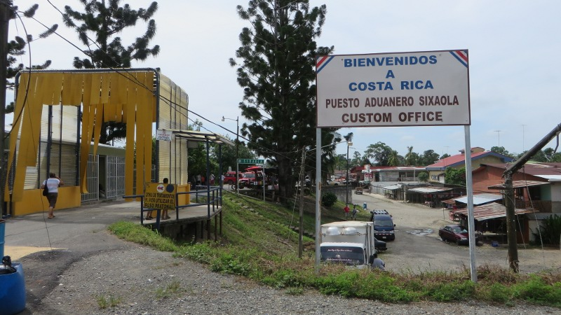
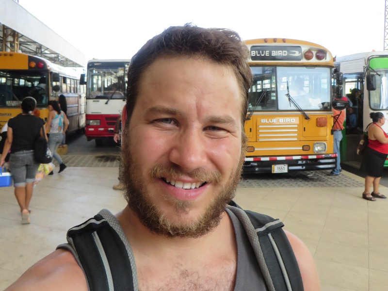

## Auf nach Costa Rica

Nachdem ich mich zehn Tage in [Bocas del Toro](https://www.google.ch/search?q=bocas+del+toro&es_sm=93&source=lnms&tbm=isch&sa=X&ei=mZePU97VINS3sASW2oGwAQ&ved=0CAgQ_AUoAQ&biw=1440&bih=767)
an der Karibikküste Panamàs mit Sonnenbaden, Tauchen, ersten Surfversuchen und Mojito trinken vergnügt habe, gehts heute
weiter ins Nachbarland Costa Rica. Um sechs Uhr morgens warte ich neben Kokospalmen auf den Bus und schaue den
Fischern zu, wie sie ihre Ware am Strand direkt an die lokalen *amas de casa* (spanisch für Hausfrauen) verkaufen. Als
der Bus wie üblich mit einer Viertelstunde Verspätung ankommt, kaufe ich ein Ticket, verstaue den Rucksack und setze
mich auf einen der zerschlissenen Sitze, wo ich noch ein bisschen Schlaf nachhole.

<figcaption>Einsamer Strand in Bocas del Toro</figcaption>

Über *Changuinola* führt die Fahrt in die Grenzstadt Sixaola, wo der Bus kurz vor Mittag ankommt. Nach einer Stunde
Schlange stehn bin ich um einen Stempel für die Ausreise aus Panamà reicher und um einige Dollar Ausreisesteuer ärmer.
Ich posiere noch kurz für ein Erinnerungsfoto mit dem Grenzwärter, dann betrete ich die alte Eisenbahnbrücke, die über
den Grenzfluss *Río Sixaola* führt. Damit ich die Brücke betreten darf muss ich ein Nutzungsentgelt entrichten,
denn in der *Schweiz Mittelamerikas* ist nichts gratis (oder billig), wie ich in den folgenden Tagen noch öfters zu spüren
bekomme. Der Zustand der Brücke lässt allerdings vermuten, dass die Gebühr nicht vollständig in deren Instandhaltung
investiert wird. So versuche ich, den losen (und teilweise fehlenden) Brettern der Brücke auszuweichen, was mit meinem
schweren Rucksack gar nicht so einfach ist. Glücklicherweise erreiche ich aber heil das Land der *Ticos* (so nennen sich
die Bewohner Costa Ricas) und stelle mich abermals in einer Schlange an um meine Einreisesteuer an Costa Rica zu
entrichten.

<figcaption>Grenzübergang nach Costa Rica</figcaption>

Nachdem sämtliche bürokratischen und physikalischen Hürden überwunden sind, gönne ich mir ein verspätetes Mittagessen in
einem *Soda* (so heissen hier die einfachen Restaurants in denen lokales Essen serviert wird):
[Gallo pinto](http://de.wikipedia.org/wiki/Gallo_Pinto). Gallo pinto bedeutet soviel wie *gefleckter Hahn* und ist ein
kreativer Name für das, was man in Panamà bekommt, wenn man Reis mit Bohnen bestellt. Das Ganze schmeckt aber vorzüglich
und ich stelle einmal mehr mit Bewunderung fest, wie gut man mit einfachen Mitteln kochen kann.

<figcaption>Grenzdorf in Costa Rica</figcaption>

## Pura Vida
Pura Vida ist wahrscheinlich der am häufigsten gehörte Ausdruck in Costa Rica. Wörtlich übersetzt bedeutet er *das reine
Leben*. Diese Übersetzung greift allerdings viel zu kurz, denn der er hat je nach Situation folgende Bedeutung
(unvollständige Liste):

- Willkommen in Costa Rica
- Hallo / Guten Tag
- Es geht mir gut
- Einen schönen Tag noch
- Schlag ein ([High Five](http://de.wikipedia.org/wiki/High_five))!
- Wunderbare Aussicht
- So ein schöner Tag
- Das Essen schmeckt vorzüglich
- Prost / Santé
- ...

<figcaption>Warten am Busterminal von Cariari</figcaption>

Der Ausdruck ist aber mehr als nur eine Floskel, welche die Ticos gegenüber von Touristen benutzen. Pura Vida ist eine
Lebensweisheit, die mit [Hakuna Matata](http://de.wikipedia.org/wiki/Hakuna_matata) vergleichbar ist. Pura Vida ist
Lebenseinstellung der Ticos, Pura Vida ist Costa Rica. Man geniesst hier den Tag, ist fröhlich und schätzt die Schönheit
des Landes. Pura Vida hat allerdings auch seine Schattenseite: Es kommt hier schonmal vor, dass der 11-Uhr-Bus nicht
kommt, weil der Chauffeur heute keine Lust hatte zu arbeiten (und eben den Tag anderweitig geniesst). Das regt aber dann
auch niemanden wirklich auf, man nimmt halt den 12-Uhr-Bus – Auch das ist Pura Vida.
