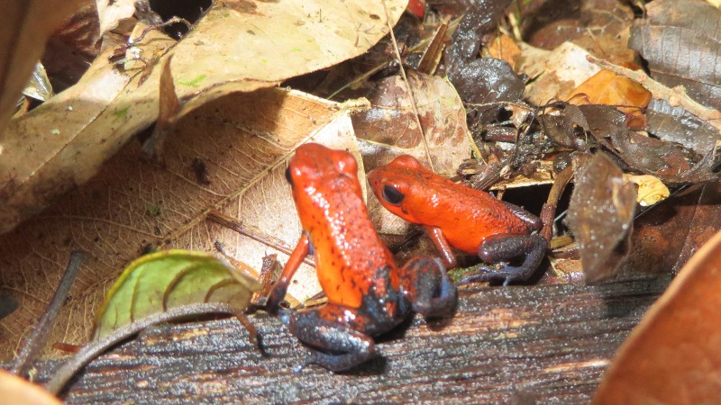
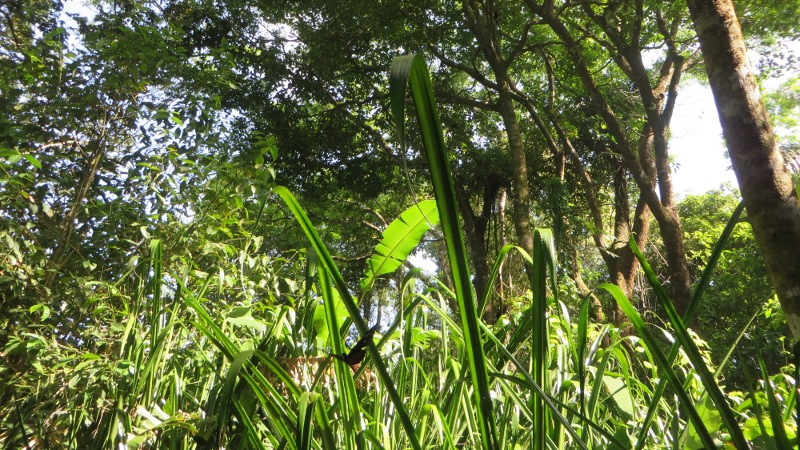
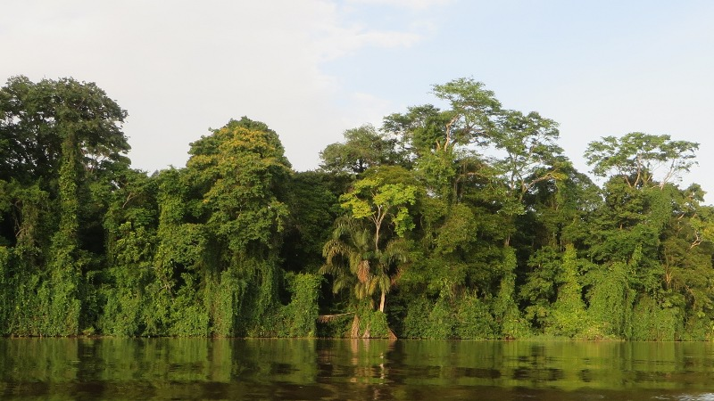
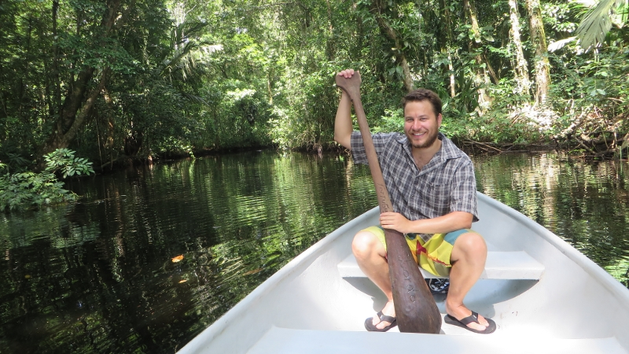
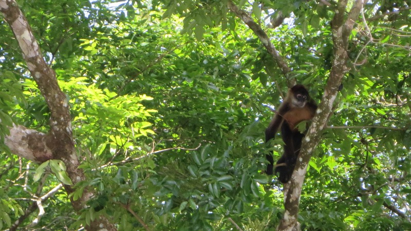
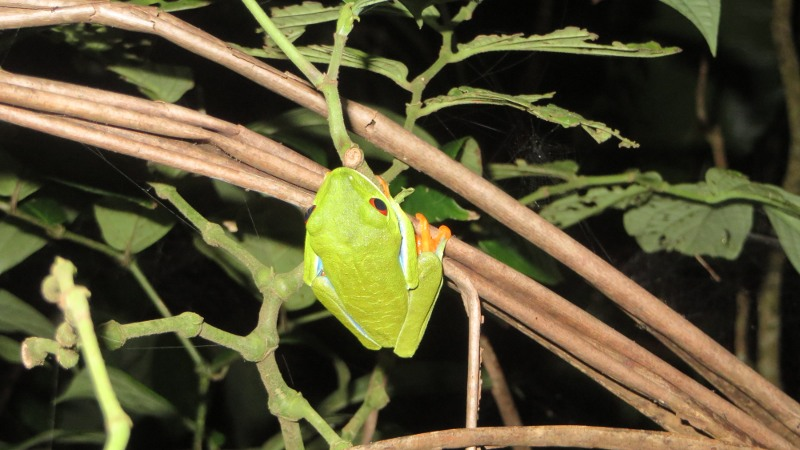
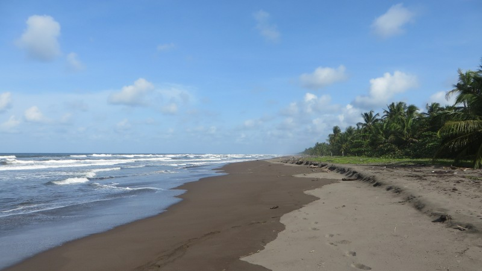

Einige Tage nach der Grenzüberquerung führt mein Weg in das Naturschutzgebiet *Tortuguero*. Ich sitze durchgeschüttelt
im für heute vierten und letzten Bus, der über eine ungeteerte Strasse durch das grasige Flachland im Norden von Costa Rica
rattert. Auf den Weiden grasen Kühe und der damit einhergehende Geruch ruft schon fast ein bisschen Heimweh hervor. Die
Szene könnte sich auch zu Hause abspielen, würden da nicht Kokospalmen den Rand der Weide säumen.

<figcaption>Fingernagelgrosse Frösche, die wegen ihrer blauen Beine „rana blue jeans“ genannt werden</figcaption>

Der Bus erreicht das Dörfchen *Pavona*, das aus einigen Baracken, einer Bar und einem Anlegesteg besteht. Am Steg
wartet bereits ein Boot, das uns nach Tortuguero bringen soll. *Uns*, das sind neben mir zwei weitere Mochileros,
sowie eine Handvoll Ortsansässigen, die sich mit Einkäufen auf dem Nachhauseweg befinden. Ausserdem ist da der
mutmassliche Dorfalki, neben dem ich zu sitzen die Ehre habe. Er quasselt mich mit allerlei Geschichten / Witzen voll,
von denen ich die Hälfte nicht verstehe und die andere Hälfte nicht versehen möchte. Ich beobachte, wie sich die Weiden
langsam in Regenwald verwandeln, während das Boot flussabwärts gleitet und nicke meinem Sitznachbarn von Zeit zu Zeit
freundlich zu.

<figcaption>Schmetterling im Wald von Tortuguero</figcaption>

Plötzlich ruft der Kapitän von hinten *Mira, un cocodrilo!* - Alle Blicke schiessen nach links und tatsächlich liegt
da ein echtes, lebendiges, majestätisch anmutendes Süsswasserkrokodil und sonnt sich am Flussrand. Ich bin schwer
beeindruckt und auch etwas eingeschüchtert, liegen doch nur wenige Meter zwischen dem riesigen (ich schätze 2.5 Meter)
Reptil und der Nussschale, in der ich sitze. Noch bevor wir das Krokodil richtig hinter uns gelassen haben fühlt sich
mein Sitznachbar inspiriert, die nächste Geschichte aufzutischen: Die Geschichte von dem Buben, der vor einigen Jahren
hier in der Nähe beim Schwimmen von einem Krokodil gefressen wurde - Alles klar, schwimmen tun wir hier also nicht.

<figcaption>Grüne Wand am Flussufer</figcaption>

Während ich in Gedanken noch dem Krokodil nachhänge, erreichen wir einen richtig grossen Fluss (wir waren bisher offenbar
nur auf einem Nebenarm). Der Anblick ist überwältigend: Der etwa hundert Meter breite Fluss wird auf beiden Seiten
von einer grünen Pflanzenwand begrenzt - So stelle ich mir den Amazonas vor. Kurz darauf erreichen wir den Bootssteg
von Tortuguero, wo ich von meinem Guide / Hotelier / Freund und Helfer Eduardo in Empfang genommen werde. Er zeigt mir
kurz, wo sich Bett, Bad, Küche und Hängematten befinden, worauf ich mich sofort schlafen lege - So ein Busfahr-Tag in
Costa Rica ist mehr als anstrengend.

Der nächste Tag beginnt früh: Um 6:00 Uhr holt mich Eduardo für eine Kanu-Tour durch den Dschungel ab. Auf dem Weg zum
Bootsteg gibt er mir ein kleines Intro in das Wildleben von Tortuguero: Fast 1000 verschiedene Tierarten gebe es hier,
die meisten davon kenne er mit Namen und habe er schon gesehn - Ich bin beeindruckt. Ausserdem lerne ich von ihm, dass
das Nationalpark, der mit 39 Jahren einer der ältesten Costa Ricas ist, zu 40% aus Wasser und Moor besteht.

<figcaption>Posieren mit selbstgemachtem Ruder</figcaption>

Als wir den Bootssteg erreichen heisst es: Paddel schnappen, ins Kanu sitzen und losrudern - Juhui. Mein anfänglicher
Enthusiasmus bezüglich des Ruderns legt sich allerdings schnell, denn nach fünf Minuten bin ich völlig ausser Atem.
Eduardo, der seit Kindstagen täglich im Kanu sitzt lacht und zeigt mir, wie man kraftsparend rudert - Ist ja garnicht so
schwer, wenn man den Trick kennt (ok, Abends habe ich dann trotzdem Blasen an den Händen). Während wir durch das atemberaubende
Dickicht gleiten, das zu Fuss kaum zu durchdringen wäre, halte ich eifrig nach Wildleben Ausschau. Mein ungeübtes Auge
erblickt aber leider nichts als Bäume und Schlingpflanzen. Eduardo hingegen erkennt alle paar Meter ein exotisches
Lebewesen: Giftige Spinnen, [Leguane](http://de.wikipedia.org/wiki/Leguan), [Kaimane](http://de.wikipedia.org/wiki/Kaimane)
und Süsswasserschildkröten. Geduldig versucht er mir zu erklären, wo die Tiere sind und freut sich jedes Mal von ganzem
Herzen, wenn ich sie endlich erkennen kann. Ich selber komme aus dem Staunen garnicht heraus und bin so beeindruckt,
dass ich völlig vergesse, die Tiere zu fotografieren.

Die Namensgeber von Tortuguero, bis zu 200 Kilogamm schwere Riesenschildkröten, bekommen wir leider nicht zu Gesicht,
da diese vom Aussterben bedroht und deshalb nur noch sehr wenige davon übrig sind. Dafür sehen wir *monos arañas*
([Spinnenaffen](http://de.wikipedia.org/wiki/Spinnenaffe)), die sich mithilfe ihrer 1.5 Meter langen Arme, Beine und
Schwanz von Baum zu Baum hangeln - Wow, Affen hatte ich bisher nur im Zoo gesehn.

<figcaption>Spinnenaffe beim Klettern</figcaption>

Plötzlich gibt Eduardo merkwürdige Brülllaute von sich. Ich fürchte kurz, dass mein Guide übergeschnappt ist, aber schon
schreit es in gleicher Weise aus dem Wald zurück: Eduardo benutzt diese Technik um im Dschungel
[Brüllaffen](http://de.wikipedia.org/wiki/Br%C3%BCllaffen) zu orten. Wir folgen dem Geschrei und als wir der Quelle
nahe sind, legen wir an. Vorbei an allerlei merkwürdien Pflanzen, die ich vorher noch nie gesehen habe, folgen dem Lärm zu
Fuss tiefer in den Wald hinein. Unterwegs sehen wir auch einige kleinere Tierchen, darunter rot, grün und blau schimmernde
Frösche (ich widerstehe dem Drang, daran zu lecken). Als wir die Brüllaffen erreichen, bin ich etwas überrascht:
Obwohl sie einen ohrenbetäubenden Lärm von sich geben sind sie sehr klein und herzig. Während wir die Affen beim
Klettern, Essen und Spielen beobachten, gesellen sich (quasi als Bonus) noch einige weissköpfige
[Kapuzineräffchen](http://de.wikipedia.org/wiki/Kapuzineraffen) hinzu.

<figcaption>Der für Costa Rica typische rotäugige Blattfrosch</figcaption>

Obwohl ich den Affen noch stundenlang zuschauen könnte, müssen wir uns langsam auf den Rückweg machen. Einmal mehr bin
ich dankbar, dass Eduardo bei mir ist, denn alleine würde ich wahrscheinlich nie mehr durch das Dickicht zum Boot und
durch das Flusslabirinth ins Dorf zurückfinden.

<figcaption>Strand von Tortuguero</figcaption>

Zurück im Dorf verbringe ich einen erholsamen Tag am Strand von Tortuguero und gehe beizeiten zu Bett, wo ich mich
farbigen Träumen der heute entdeckten Flora und Fauna widme. Anderntags gehts schon wieder weg von Tortuguero. Ich nehme
Abschied von Eduardo und warte pünktlich am Hafen auf das 9:00-Uhr-Boot. Obwohl bereits 9:20 Uhr ist, mache ich mir
keine Sorgen - Das Boot wird schon irgendwann auftauchen. Pura Vida.