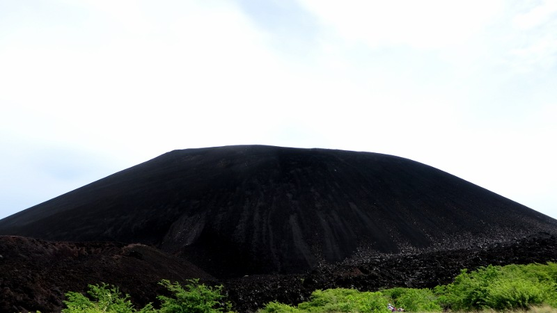
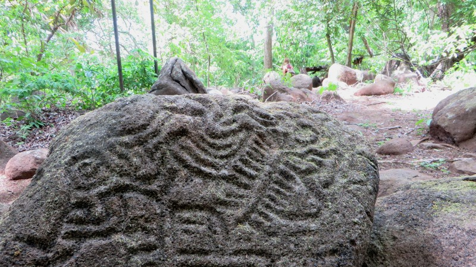

Zweieinhalb Monate Mittelamerika sind wie im Flug vergangen. Nicaragua war definitiv die Krönung dieses Reiseabschnitts.
Nicaragua heisst: Wunderschöne Natur, günstige Unterkünfte mit tropischen Gärten, gutes Essen und extrem freundliche
Menschen, die trotz ihrer teilweise starken Armut immer aufgestellt und fröhlich sind. Trotzdem (oder vielleicht gerade
deshalb) konnte ich nie gleichzeitig Zeit und Lust finden, um einen Blogpost zu schreiben. Deshalb verabschiede ich
mich lediglich mit einer kleinen Auswahl an Bildern von Nicaragua - Mögen sie mehr sagen, als tausend Worte.

<figcaption>Cerro Negro - Vulkan, der letztmals 1999 aktiv war</figcaption>

<figcaption>Auf dem windigen Gipfel des Cerro Negro</figcaption>

<figcaption>Frisch geprüft</figcaption>

<figcaption>Biblische Graffiti in Masaya</figcaption>

<figcaption>Taxi auf der Isla Los Brasiles</figcaption>

<figcaption>Granada - Handelszentrum Mittelamerikas zur Kolonialzeit</figcaption>

<figcaption>Töpferkunst</figcaption>

<figcaption>Landzunge auf der Vulkaninsel Ometepe</figcaption>

<figcaption>Kathedrale von León</figcaption>

<figcaption>Gängiges Transportmittel in Nicaragua</figcaption>

<figcaption>Petroglyphen aus der Maya-Zeit</figcaption>
