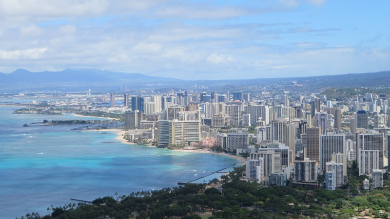
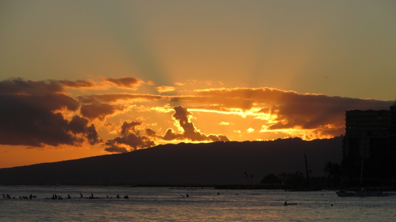

<figcaption>Am zauberhaften Strand von Waimanalo</figcaption>

Ich verlasse Managua, die chaotische Hauptstadt Nicaraguas bereits im Morgengrauen. Nach vielen Stunden in Taxi, Bus
und Flugzeug und einer ungemütlichen Nacht am Flughafen von Houston, Texas (ich hab wie ein Clochard im unterirdischen
Bahnhof geschlafen) erreiche ich endlich mein Hostel in Honolulu auf der hawaiianischen Insel [Oʻahu](http://de.wikipedia.org/wiki/Oahu).
Meine Energie reicht gerade noch, um den Rucksack in eine Ecke zu stellen und die Schuhe auszuziehen, bevor ich übermüdet
ins Kajütenbett gleite wo mir sofort die Augen zufallen. Noch nie habe ich so gut geschlafen.

## Der grosse Kulturschock

<figcaption>Hawaiis Hauptstadt Honolulu</figcaption>

Eigentlich hätte ich ja erwartet, dass ich den grossen Kulturschock dieser Reise in Panama erleben werde. Entgegen dieser
Erwartung erwischt er mich aber in Hawaii. Mag sein, dass ich mich in zehn Wochen etwas zu gut mit der mittelamerikanischen
Laissez-Faire-Mentalität arrangiert habe. Möglicherweise hatte ich auch ein etwas zu romantisches Bild vom gelassenen
Inselstaat inmitten des Pazifiks. Aber es besteht kein Zweifel, ich befinde mich hier definitiv in den USA: Viele Leute
sind unfreundlich (erstaunlicherweise vor allem die, denen ich etwas abkaufe), alles muss aus Prinzip geplant und
reserviert werden (als ich ohne Reservation in einem Hostel auftauche gibts zuerst eine Schelte, dann eines der vielen
freien Betten) und selbstverständliche Dinge wie ein Schliessfach im Hostel kosten gerne mal extra. Ausserdem ist alles
voll von lächerlichen Verboten (sprechen im Bus ist z.B. nicht erlaubt), sowie Überwachungskameras und Polizisten um
deren Befolgung zu garantieren.

<figcaption>Aus diesen Blumen werden die traditionellen Blumenkränze Hawaiis (Leis) hergestellt</figcaption>

Natürlich ist hier nicht alles schlecht: Die Leute sind dem Klischee entsprechend extrem offen und so kommt man noch
einfacher ins Gespräch als in Mittelamerika. Sowohl Städte, als auch Natur sind hier sehr sauber, was unter anderem auf
die vielen öffentlichen Mülleimer (etwas, das ich letztmals in der Schweiz gesehen habe) zurückzuführen ist. Mein
sporadisch auftretendes Heimweh wird ausserdem durch die Preise etwas beruhigt, denn die sind hier wie zu Hause. Und
obwohl die Busse nicht immer ganz pünktlich sind, gibts hier doch zumindest einen Fahrplan. Dieser gestaltet sich
allerdings eher übersichtlich, denn normalerweise benutzt man hier nicht den Bus, sondern einen SUV um zum Supermarkt
(in dem es zwar mehr als zehn Sorten Ketchup, allerdings kaum frische Tomaten gibt) oder zum Burger King zu fahren.

<figcaption>Leuchtturm am östlichsten Punkt von Oʻahu (Makapuʻu Point)</figcaption>

## Pearl Harbor - Ein Stück Geschichte

Einige Tage später wache ich frühmorgens in einem relativ heruntergekommenen Hostel in [Waikiki](http://de.wikipedia.org/wiki/Waikiki)
auf. Das einzige, das in diesem Hostel an Luxus erinnert, ist der stinkende Müllcontainer vor dem Eingang, der immerhin
auch vom [Marriott-Hotel](http://de.wikipedia.org/wiki/Marriott_International) benutzt wird. An ebendiesem Container vorbei
laufe ich möglichst schnell zur nahen Bushaltestelle, um den Bus nach [Pearl Harbor](http://de.wikipedia.org/wiki/Pearl_Harbor),
Kriegsschauplatz des Pazifik-Konflikts während des zweiten Weltkriegs, zu erwischen. Kurz nachdem der Bus losfährt,
setzt sich einer der vielen Obdachlosen Honolulus auf den Sitz vor mir und der Bus füllt sich mit einem Geruch wie dem des
Marriot-Containers. Ich denke darüber nach, wie traurig es ist, dass es hier mehr Obdachlose gibt als im kirchenmausarmen
Nicaragua und versuche mir möglichst dezent die Nase zuzuhalten, während der Bus die Wolkenkratzer Honolulus langsam
hinter sich lässt.

<figcaption>Über diesen Bergen erschienen am Morgen des 7. Dezember 1941 die japanischen Kampfflieger - Künstliche Inseln erinnern an die Standorte der versenkten Schiffe</figcaption>

Pearl Harbor ist heute Museum, Gedenkstätte und nach wie vor ein Stützpunkt der US-Marine. Die «Hauptattraktion» der
Gedenkstätte ist die [USS Arizona](http://de.wikipedia.org/wiki/USS_Arizona_(BB-39)), ein Schlachtschiff, das bei dem
Angriff Japans auf Pearl Harbor versenkt und nie geborgen wurde. Als ich dort ankomme, heissts allerdings erstmal warten,
denn mein Ticket zur Besichtigung der *USS Arizona* kann wegen dem
grossen Andrang erst in vier Stunden eingelöst werden. Diese Zeit vertreibe ich mit dem Besuch der
[USS Bowfin](http://de.wikipedia.org/wiki/USS_Bowfin_(SS-287)), einem U-Boot aus dem zweiten Weltkrieg. Das Innere des
Unterseeboots ist technisch sehr beeindruckend (vor allem wenn man bedenkt, dass dieses vor mehr als 70 Jahren gebaut
wurde). Ausserdem ist der Platz extrem knapp und das Ganze fühlt sich ein bisschen wie ein grosses Wohnmobil für 80
Personen an. Aus Platzgründen durfte die Besatzung des U-Boots nicht grösser als 1.70m sein und vom Schlafen übers Duschen bis hin
zum Essen wurde so ziemlich alles in Schichten vollzogen. Wieder an der frischen Luft
schlendere ich durch die zahlreichen Gedenktafeln und Museen Pearl Harbors. Obwohl so viele spannende Details zu
erfahren sind, bin ich von der einseitigen Darstellung der [Geschichte](http://de.wikipedia.org/wiki/Angriff_auf_Pearl_Harbor)
etwas enttäuscht - Auch 70 Jahre nach Kriegsende riecht hier alles nach Propaganda.

<figcaption>Überreste der versenkten USS Arizona - Moderne Flugzeugträger im Hintergrund</figcaption>

Endlich bin ich dran, die *USS Arizona zu besuchen*. In einem Boot gehts zur Plattform, die über dem versenkten
Kriegsschiff aufgebaut wurde. Das Boot fährt vorbei an modernen Flugzeugträgern, die ich aus politischer Sicht
abstossend, aus technischer Sicht aber extrem faszinierend finde (die Flugzeuge sind zur Machtdemonstration der Marine
übrigens auf Deck ausgestellt). Als das Boot die Plattform erreicht, betreten wir die Plattform und ein Schauder fährt
über meinen Rücken: Eine endlos lang scheinende Gedenktafel erinnert an die 1'177 *Marines* (englisch für Marinesoldaten),
die allein auf diesem Schiff umgekommen sind (ein Grossteil davon befindet sich übrigens immernoch im Inneren des Schiffes).
Neben der Plattform schauen noch Teile des versenkten Schlachtschiffs aus dem Wasser. Während uns ein Guide über die
Details des Angriffs unterrichtet, schauen wir dem Öl zu, das seit über 70 jahren aus dem Schiffswrack blubbert (und es
laut Auskunft des Guides auch noch für weitere hundert Jahre tun wird). Nachdenklich und bedrückt fahren wir ins
Besucherzentrum zurück.

## Waikīkī

<figcaption>Surfersalat in der Nähe von Waikiki</figcaption>

Nach diesem anstrengenden Tag gönne ich mir Abends etwas Entspannung am Strand von [Waikiki](http://de.wikipedia.org/wiki/Waikiki).
Hier, wo sich über den Tag Badetuch an Badetuch reiht, wirds Abends etwas ruhiger, denn dann zieht sich der Connaisseur
zum Hummer-Essen in einem überteuerten Strandlokal zurück. Gut für mich, denn obwohl Waikiki der wohl touristischste
Flecken Hawaiis ist, ists eben auch ein wunderschöner Strand, der sich zudem mitten in der Stadt befindet und so eine
einmalige Kulisse bietet.

<figcaption>Künstlicher See in Waikiki</figcaption>

An diesem Strand lasse ich mich also auf meinem Badetuch, das riecht wie eine Mischung aus Sonnencrème und nasser Hund,
nieder und geniesse den atemberaubenden Sonnenuntergang. Einige Palmen weiter spielt ein anderer *Backpacker* (englisch
für Rucksacktourist) auf seiner Ukulele. Ich lausche der Musik und gönne ich mir einen Tropfen
[Flor de Caña](http://de.wikipedia.org/wiki/Flor_de_Ca%C3%B1a), den ich aus Nicaragua mitgebracht habe. Natürlich
befindet sich der Rum in einer Cola-Flasche, denn wie fast alles andere ist auch das Trinken von Alkohol am Strand in
Hawaii streng verboten.

<figcaption>Sonnenuntergang in Honolulu</figcaption>
