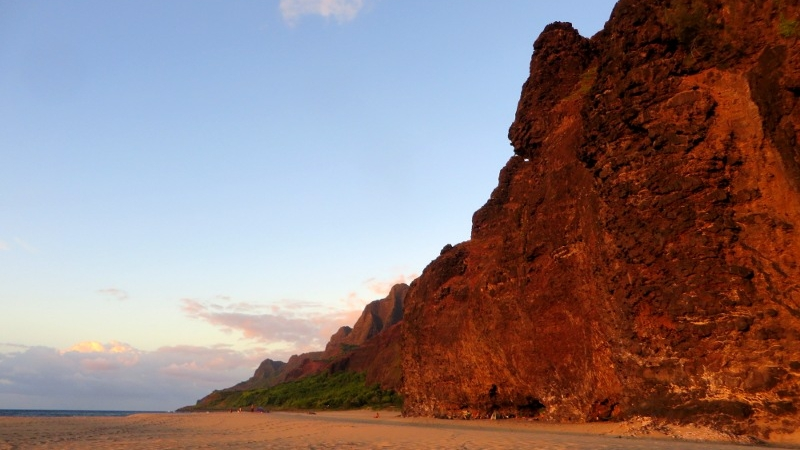
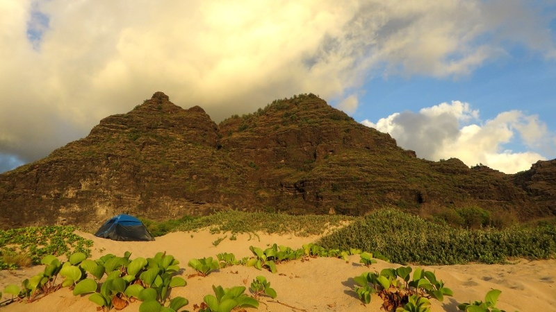
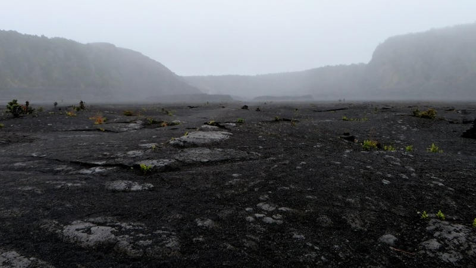
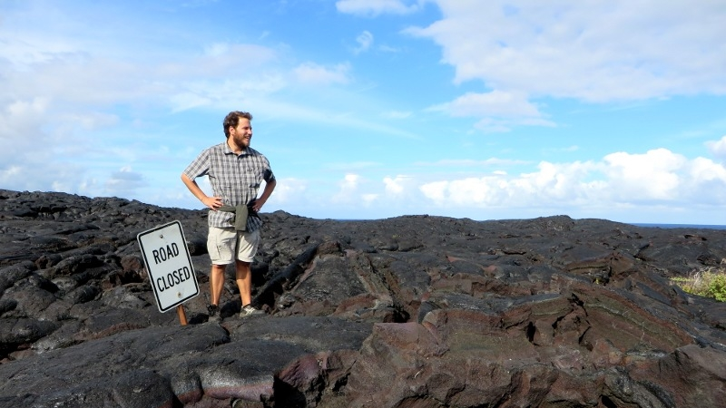
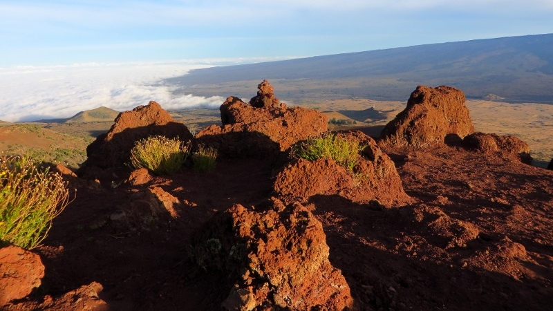
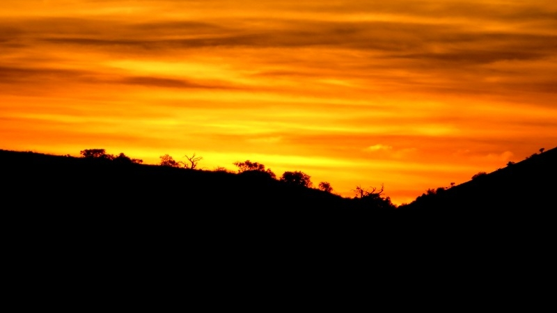
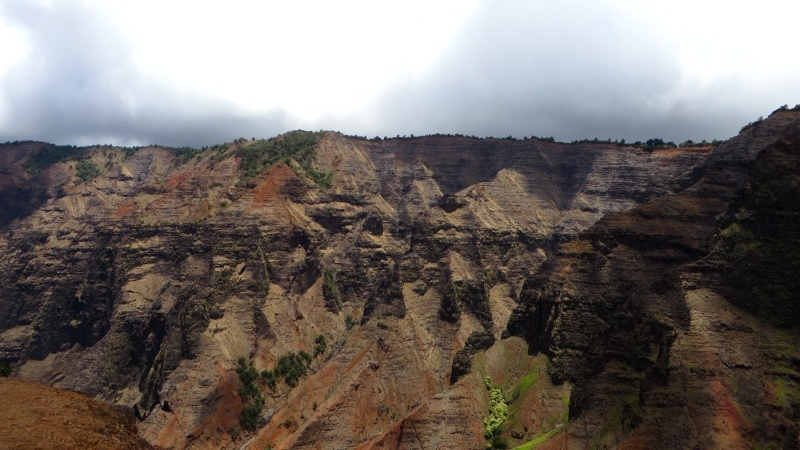
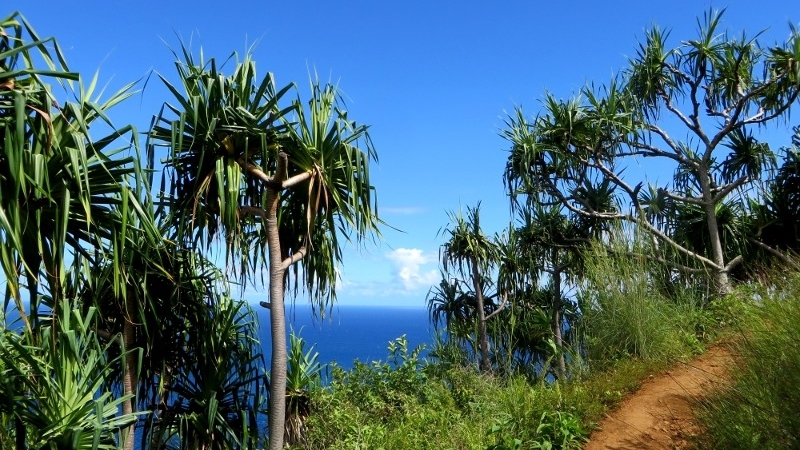
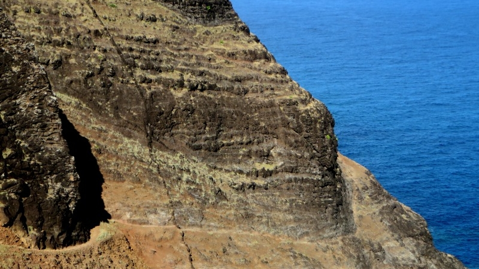
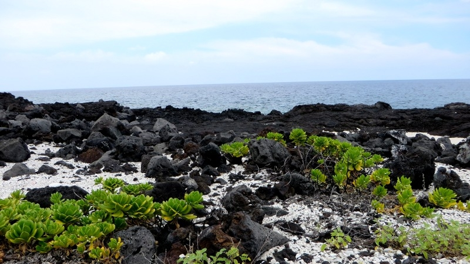

## Hawaiianische Gastfreundschaft

<figcaption>Strand von Polihale</figcaption>

In dem Schiff von Auto, das ich bekommen habe, als ich beim Autovermieter nach dem kleinsten verfügbaren Modell verlangt
habe, fahre ich über eine staubige Strasse in Richtung [Polihale Strand](http://en.wikipedia.org/wiki/Polihale_State_Park)
im abgelegenen Westen der Insel [Kauaʻi](http://de.wikipedia.org/wiki/Kaua%CA%BBi). Die älteste Insel Hawaiis wird auch
*The Garden Island* (englisch für Garteninsel) genannt, und das zu Recht: Wegen dem häufigen Regen (Kauaʻi ist einer der
regenreichsten Punkte der Erde) und der tropischen Wärme blüht es überall üppig grün. Ausserdem ist ein grosser Teil von
Kauaʻi (im Kontrast zu Oʻahu mit seinem berüchtigten Waikiki-Beach) noch relativ wild.

<figcaption>Camping in Polihale</figcaption>

Während ich durch die zunehmend wildere Natur fahre, verwandelt sich die Strasse langsam von Staub zu Sand. Ich hoffe,
dass ich nicht stecken bleibe, denn streng genommen dürfte ich mit meinem Schickimicki-Auto die geteerten Strassen nicht
verlassen. Trotzdem bin ich froh, ein Auto gemietet zu haben, denn in der Woche davor war ich auf Hawaiis grösster Insel
[Big Island](http://de.wikipedia.org/wiki/Hawaii_(Insel)) ziemlich unmobil: Einen Bus gibts dort nämlich nur einmal Morgens
und einmal Abends. So fuhr ich halt per Anhalter (was in Hawaii sehr viel Zeit in Anspruch nimmt) zu entlegenen
Vulkangebieten, Stränden, dem höchsten Berg Hawaiis und in die sympathische Studentenstadt Hilo und verbrachte ausserdem
ziemlich viel Zeit im Haus meiner herzlichen Schlummermutter *Chandy*.

<figcaption>Mondlandschaft auf Big Island</figcaption>

Ich erreiche das Ende der Polihale-Strasse - Glücklicherweise ging alles gut. Ich parkiere den Wagen und lege die letzte
Strecke zum Strand zu Fuss zurück. Es bietet sich mir ein atemberaubender Anblick: Vor den majestätischen roten Bergen
der [Nā Pali Berge](http://en.wikipedia.org/wiki/N%C4%81_Pali_Coast_State_Park) erstreckt sich über mehrere Kilometer ein
riesiger hellgelber Sandstrand, der locker mit den Stränden Mittelamerikas mithalten kann. Und der Strand ist auch fast
gleich ruhig wie die verlassenen Strände Panamas - Abgesehen von einigen Einheimischen Campern gibts hier nur eine
handvoll Teenies, die vor Einbruch der Nacht mit Daddys 4x4 am Strand herumblochen.

<figcaption>Vulkanpark auf Big Island: Nur noch ein altes Verkehrsschild erinnert an die Strasse, die 1983 von einem Lavastrom überflutet wurde</figcaption>

In der gleissenden Hitze stelle ich auf einer Erhöhung am Strand (ich möchte ja am nächsten Morgen nicht von der Flut
geweckt werden) mein Zelt auf und begebe mich sogleich auf eine Erkundungstour. Nach kurzem Marsch winkt mich ein
hawaiianisch aussehender Mann mittleren Alters zu sich und seiner Gruppe. Er stellt sich als Shawn vor und bietet mir
sofort einen Stuhl im Schatten und ein kühles Bier an, was bei dieser Hitze unmöglich auszuschlagen ist. Wir kommen rasch
ins Gespräch und es stellt sich raus, dass Shawn Chef der Feuerwehr von Kauaʻi ist und mit seinem Team samt Familie für
ein paar Tage zum Camping nach Polihale gefahren ist. Ich lerne, dass Familie in Hawaii sehr viel bedeutet - man verbringt
möglichst viel Freizeit im Kreis seiner Verwandten. *Familie* hört allerdings nicht bei Blutsverwandten auf, sondern
umfasst *das gesamte hawaiianische Volk*, wie Shawn erklärt. So erstaunt es denn nicht, dass die Kinder alle anwesenden
Erwachsenen *auntie* (englisch für Tantchen) und *uncle* (englisch für Onkel) nennen. Während wir den malerischen
Sonnenuntergang bestaunen, wird [Ahi Poke](http://en.wikipedia.org/wiki/Poke_(Hawaii)), ein köstliches Traditionsgericht
aus mariniertem rohem Thunfisch, serviert und Shawns Tochter spielt auf der Ukulele hawaiianische Volkslieder.

<figcaption>Am Mauna Kea, dem höchsten Berg Hawaiis</figcaption>

Als sich dieser authentische Abend mit viel Aloha (hawaiianisches Sammelwort für allerlei positive Emotionen) dem Ende
neigt, verabschiede ich mich und schlendere zurück zu meinem Zelt. Beseelt von der hawaiianischen Gastfreundschaft liege
ich noch etwas vor meinem Zelt im Sand und bestaune den hell leuchtenden Sternenhimmel...

<figcaption>Sonnenuntergang am Mauna Kea</figcaption>

## Wandermarathon im Nā Pali Gebiet

Nach drei Tagen verlasse ich Polihale, um auf der anderen Seite der Nā Pali Berge den
[Kalalau-Trail](http://en.wikipedia.org/wiki/Kalalau_Trail) zu bewandern. Obwohl der Wanderweg nur ungefähr 10
Kilometer Luftlinie von hier entfernt ist, steht mir zuerst eine lange Autofahrt bevor. Im Nordwesten von Kauaʻi
gibts nämlich keine Strasse und so muss ich um die ganze Insel fahren, um ans andere Ende des Naturparks zu gelangen.
Vorbei an wunderschönen Stränden, an denen VW-Busse mit Surfbrett-Trägern parkiert sind, fahre ich an die Nordküste an
den *Keʻe Beach*, wo der Kalalau-Trail seinen Anfang nimmt.

<figcaption>Waimea Canyon (der Grand Canyon des Pazifiks)</figcaption>

Ich parkiere mein Mietauto und lege sogleich los - bepackt mit Schlafsack, Proviant und viel Wasser. Obwohls hier etwas
weniger heiss ist als in Mittelamerika, bin ich bald schweissüberströmt, denn ganz so kühl wie beim Wandern in den Alpen
ist's dann doch nicht. Zu Beginn des Trails begegne ich noch zahlreichen Touristen, die den 3 Kilometer entfernten
*Hanakapiai-Strand* besuchen. Danach dünnt sich der Touristenstrom rasant aus und die atemberaubende Aussicht
über den Nordpazifik gehört mir fast allein.

<figcaption>Unterwegs auf dem Kalalau-Trail</figcaption>

Vorbei an wilden Palmen, Passionsfrucht- und Avocadobäumen folge ich dem Wanderweg, der durch die Täler, Bäche und
tropischen Strände der Nordwestküste von Kauaʻi führt. Es gibt auch einige brenzlige Passagen, an denen die Klippen gleich
neben dem Weg 40 Meter senkrecht abfallen - Nicht der beste Ort um zu stolpern. Hier und da sehe ich einen der vielen
flugunfähigen Vögel durchs Dickicht irren (weil Hawaii so weit von anderen Landmassen entfernt ist, gibts hier viele
Vogelarten, die es nirgendwo sonst auf der Welt gibt).

<figcaption>Klippen am Kalalau-Trail</figcaption>

Nach 11 Meilen (oder 18 Kilometern) und einer Gallone (oder 3.8 Litern) Wasser ist die Wanderung geschafft und ich
erreiche den Strand von
*Kalalau*. Die Anstrengung hat sich gelohnt, denn der Anblick auf die von der Abendsonne rot beschienenen Felsen ist
wirklich überwältigend. Bei einem nahen Bach drehe ich mein verschwitztes T-Shirt aus und erfrische mich im kühlen Nass.
Danach geniesse ich mein aus Trockenfutter bestehendes Abendessen, während die Sonne langsam hinter dem Horizont verschwindet.
Der Strand von Kalalau bietet wunderschöne Höhlen zur Übernachtung. Da diese aber bereits mit Campern (die teilweise hier zu
leben scheinen) vollgepackt sind, suche ich mir einen Schlafplatz direkt am Strand. Ich krieche in meinen Schlafsack
unter dem Sternendach und die Anstrengungen des Tages lassen mich schnell in einen tiefen Schlaf fallen. Das ist gut so,
denn morgen muss ich fit sein, um die 18 Kilometer wieder zurück zu laufen.

<figcaption>Strand mit Vulkangestein</figcaption>
