Seit Ende Juli befinde ich mich in Indonesien, dem grössten Inselstaat der Welt. Hier bin ich mit Antonia unterwegs, die
mich während ihrer Sommerferien auf meinem Reislein besucht.

## Ferien von den Ferien

Nachdem wir im Dörfchen [Jimbaran](http://de.wikipedia.org/wiki/Jimbaran) in Bali unseren Jetlag auskuriert haben,
machen wir uns per Boot auf zu den bei Lombok liegenden [Gili-Inseln](http://de.wikipedia.org/wiki/Gili-Inseln).

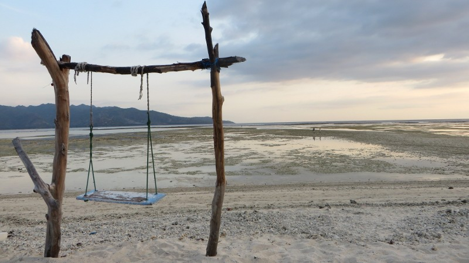
<figcaption>Schaukel auf der Insel Gili Air</figcaption>

Auf meiner bisherigen Reise hatte ich regelmässig Leute getroffen, die schon in Indonesien unterwegs waren. Einstimmig
haben alle die Gilis als absolutes Inselparadies gelobt – und sie sollten Recht behalten: Die Gilis, das sind drei
wunderschöne Inselchen, die nur auf wenige Meter über Meer ansteigen und deren weissen Strände von Kokospalmen gesäumt
werden.

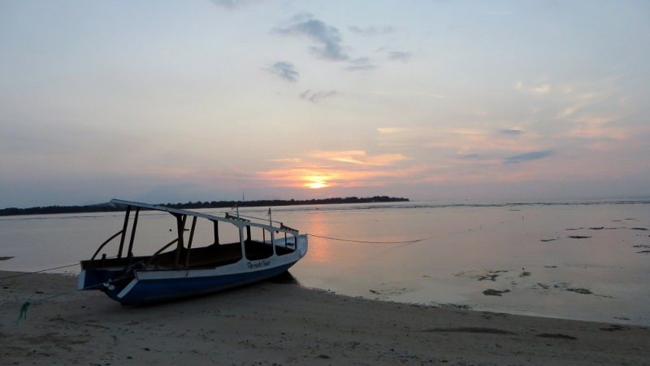
<figcaption>Sonnenuntergang auf der Insel Gili Air</figcaption>

Das Ganze ist leider nicht mehr wirklich ein Geheimtipp und so leben die pro Insel ungefähr 500 permanenten
Einwohner heute vor allem vom Tourismus – Fischerei und Kokosnussexport sind etwas in den Hintergrund geraten. Boomender
Tourismus heisst aber auf der positiven Seite, dass sich überall auf den Inseln geschmackvolle Strandlokale befinden, die sich
mit jeweils noch etwas bequemeren Sitzgelegenheiten zu übertrumpfen versuchen. Diese Sitzgelegenheiten wollen natürlich
alle ausprobiert sein und so bleiben wir fast zehn Tage auf den Gilis (nach den Abenteuern der vergangenen 15 Wochen
habe ich mir ja schliesslich auch mal ein bisschen Ferien von den Ferien verdient). Die Tage auf den Gilis laufen
allesamt sehr ähnlich ab: Frühstück am Strand, Joggingrunde um die Insel (fast wie eine Joggingrunde um den
[Schwarzsee](http://de.wikipedia.org/wiki/Schwarzsee_(Plaffeien)), nur dass das Wasser auf der Aussenseite liegt),
Sonnen- und Wasserbaden, Snack am Strand, traditionelle Massage am Strand, Sonnen- und Wasserbaden, Fisch-Barbecue am
Strand, Cocktail bei romantischem Sonnenuntergang am Strand.

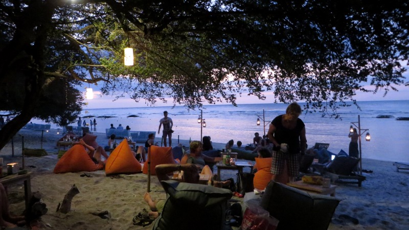
<figcaption>Strand-Lounge auf der Insel Gili Trawangan</figcaption>

Nach diesen erholsamen Tagen sind wir bereit für die nächste Destination: Kuta Lombok (nicht zu Verwechseln mit
[Kuta Bali](http://de.wikipedia.org/wiki/Kuta), dem Ballermann Indonesiens) im Süden der Insel.

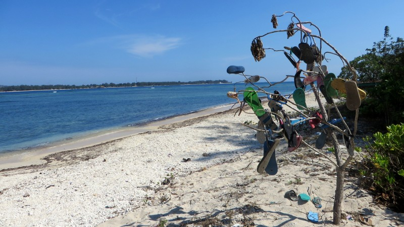
<figcaption>Falls ihr euch schon immer gefragt habt, wo eigentlich Flipflops herkommen...</figcaption>

## Rollerfahrt durchs Paradies

Eine Woche später werde ich (wie in den zwei Tagen davor) noch während der Dämmerung von einem lauten Singsang aus dem
Schlaf gerissen: Der [Muezzin](http://de.wikipedia.org/wiki/Muezzin) von Kuta hat sich soeben in der Moschee, die direkt
neben unserer Unterkunft liegt, zum Morgengebet eingefunden.

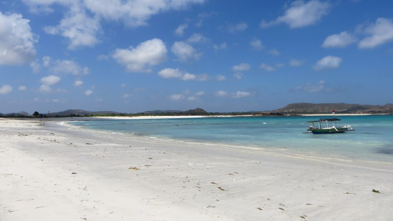
<figcaption>Fischerboot in Tanjung Aan</figcaption>

Obwohl der Muezzin nur über beschränktes musikalisches Talent verfügt, sind die Lautsprecher der Moschee voll aufgedreht
und so wars das für heute schon mit dem Schlafen. Ich stehe auf und gehe ins Badezimmer unseres Bungalows (das über kein
Dach, dafür aber über einen integrierten Garten(!) verfügt). Ich verscheuche eine Echse von der Grösse einer Hauskatze
und drehe den Hahn der Dusche auf. Leider rückt diese partout kein Wasser aus, denn die Wasserpumpe hat gerade keinen Strom
(Stromausfälle gehören in Indonesien zur Tagesordnung). Deshalb mache ich mich auf zum nahen Meer, um mich dort ein
bisschen zu waschen.

Im Dorf herrscht schon reger Betrieb, denn heute ist Markttag. Bereits zwei Strassen vor dem Marktplatz staut sich der
Verkehr: In einem Chaos, neben dem der Strassenverkehr Panamas schon fast geordnet scheinen würde, drängen sich zahllose
Motorroller wie Ameisen an kleinen aber vollgestopften [Bemos ](http://de.wikipedia.org/wiki/Bemo_(Kleinbus))
(indonesiche Sammeltaxis) vorbei. Vierköpfige Familien (die Mutter, auf deren Arm ein Baby schläft, schreibt auf dem
hinteren Sitz lässig eine SMS) werden hier genauso per Roller transportiert wie Möbel oder riesige Säcke voller
Lebensmittel, die auf dem Markt verkauft werden sollen. Zu den kuriosen Verkehrsteilnehmern gehört ausserdem ein Pickup,
der eine Kuh transportiert. Einen Helm trägt man hier als Rollerfahrer im Normalfall nicht.

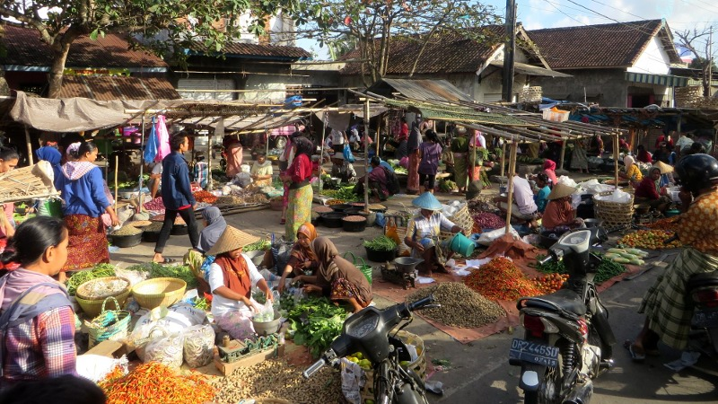
<figcaption>Bunter Markt</figcaption>

Auf dem Markt geht es nicht weniger betriebsam zu und her, als auf der Strasse: Verhüllte Hausfrauen feilschen mit sturen
Händlern um den Preis der dargebotenen Ware: Frische Sardinen, Garnelen und Tintenfische (die allerdings mit noch
frischeren Fliegen übersät sind), Reis, getrockneter Tabak, Bohnen, Kokosnüsse, Bananen, Ananas,
[Salak](http://de.wikipedia.org/wiki/Salakpalme) und vieles mehr. Ich werde natürlich von zahlreichen Händlern
angesprochen, denn die Aussicht einen Europäer übers Ohr hauen zu können, ist in Indonesien eine Chance, die man
keinesfalls verpassen darf. Böse sein kann ich den Händlern dafür freilich nicht, denn die meisten Leute hier sind
wirklich sehr arm und auch wenn man nichts kauft wird man immer mit einem herzlichen Lachen und einem *terima kasih*
(indonesisch für *danke*) belohnt.

Nach meinem Ausflug zu Meer und Markt gehts zurück in den Bungalow, wo ich Antonia wecke. Wir geniessen ein reichhaltiges
Früchstück aus Bananenpfannkuchen, einem süssen Früchteteller und einem Krug *Lombok Kaffee*. Lombok Kaffee ist im
Unterschied zum Kaffee, wie er in der Schweiz getrunken wird, ungefiltert und man muss deshalb vor dem Trinken einige
Minuten warten (wie wir auf die ungeniessbare Art gelernt haben). Nach dem Frühstück packen wir die Badesachen und
starten unseren Motorroller, das Transportmittel der Wahl auf Lombok.

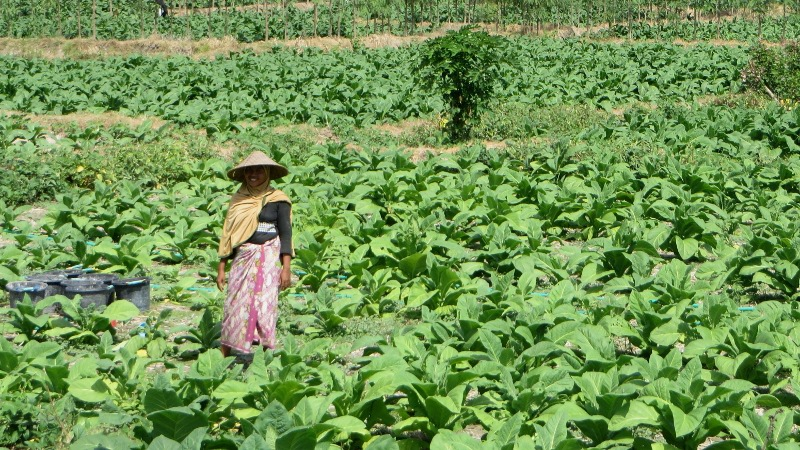
<figcaption>Tabakpflückerin</figcaption>

Nach wenigen Fahrminuten befinden wir uns bereits in einer atemberaubenden Landschaft von Reis- und Gemüsefeldern. Der
Tourismus steckt im Süden Lomboks noch in den Kinderschuhen und so wird die teilweise etwas holprige Strasse lediglich
von einigen ärmlichen Hütten geziert. Das bedeutet allerdings nicht, dass man hier eine ruhige Fahrt durch die Natur
unternimmt. Neben Linksverkehr und unzähligen Motorrollern (fast jede Familie in Lombok hat mindestens einen Motorroller
geleast) hält die Strasse allerlei Überraschungen bereit: Hühner, Kühe und Hunde befinden sich genauso auf der Strasse
wie Kinder und tratschende Leute. Schlaglöcher, starke Steigungen und abrupte Kurven runden das Fahrerlebnis ab und so
fühlt sich hier eine Rollerfahrt eher an wie ein [Jump’n’Run-Game](http://de.wikipedia.org/wiki/Jump_and_run).

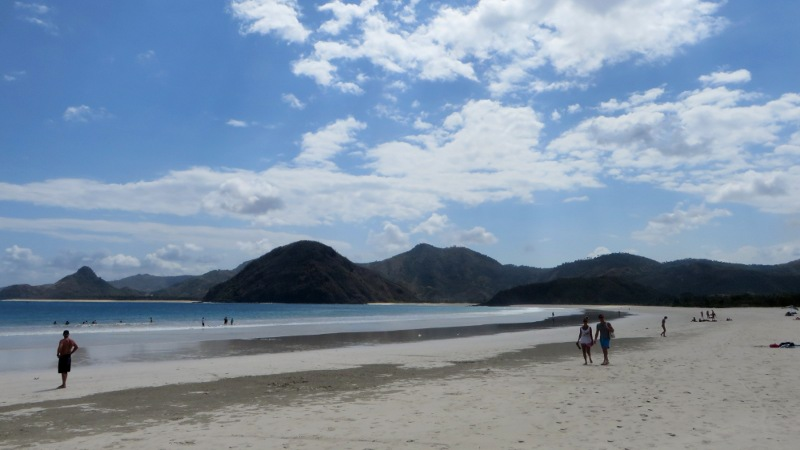
<figcaption>Der Strand von Selong Belanak</figcaption>

Nach knapp 40 Minuten ist das erste Level der Rollerfahrt zu Ende und wir erreichen *Selong Belanak*. Wir sind
überwältigt: Die weitläufige Bucht aus hellblauem Wasser wird von einem flachen, weissen Sandstrand umrundet –
Wow, wahrscheinlich der schönste Badestrand meiner Reise! Wir legen uns in die Sonne und kühlen uns gelegentlich ein
bisschen im herrlich erfrischenden Wasser ab. Zwischendurch versuchen wir die zahlreichen Bettelkinder abzuwimmeln, die für
ihre Eltern (und die Mafia) Schmuck verkaufen. Dies gestaltet sich nicht immer ganz einfach, denn neben einem herzigen
Lächeln haben sie auch allerlei Sprüche wie *open your heart, open your wallet* (englisch, etwa *öffne dein Herz, öffne
dein Portemonnaie*) drauf.

Nachdem die Ebbe ein weiteres Stück Sandstrand preisgibt, krabbeln aus dem Sand tausende von wunderlichen Tierchen, die ich
bisher noch nie gesehen habe: Daumennagelgrosse Krebschen, die fleissig Sandkügelchen formen und wegspicken. Wir haben
absolut keine Ahnung, warum sie das machen. Wir sind  aber vom Anblick des Schauspiels so fasziniert, dass wir die
Krebschen solange beobachten, bis nach einer Stunde der ganze Strand auf einem drei bis vier Meter breiten Streifen von
diesen Sandkügelchen übersät ist. Nur schade, dass mit der nächsten Flut alle Kügelchen zerstört werden und die
[Sisiphus-Arbeit](http://de.wikipedia.org/wiki/Sisiphus) von vorn beginnen muss.

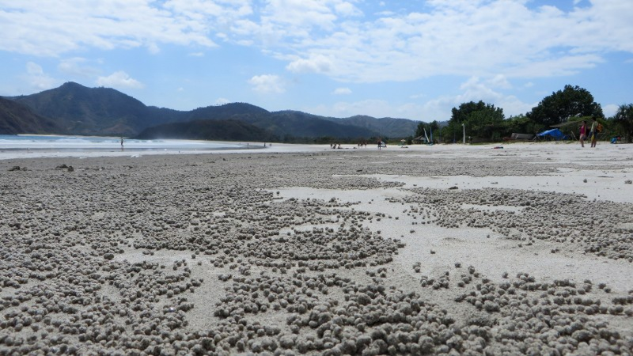
<figcaption>Das Werk der Sandkugelkrebschen</figcaption>

Der Hunger treibt uns schliesslich von den Sandkugelkrebschen weg in ein [Warung](http://de.wikipedia.org/wiki/Warung)
(einfaches indonesisches Restaurant) direkt am Strand. Im Schatten einer windschiefen Bambuskonstruktion geniessen wir
ein köstliches [Nasi Goreng](http://de.wikipedia.org/wiki/Nasi_Goreng), das Nationalgericht Indonesiens, das aus Reis,
Gemüse und *ayam* (indonesisch für *Poulet*) besteht. Zum Dessert gibts Bananenchips und
[Salak](http://de.wikipedia.org/wiki/Salakpalme), eine braune Frucht, die so gross ist wie eine Aprikose und
geschmacklich an eine Ananas erinnert. Danach treten wir das zweite Level der Rollerfahrt an: Die Rückfahrt mit vollem
Magen.

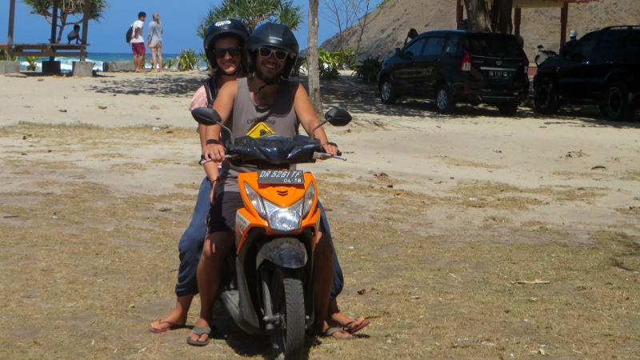
<figcaption>Mit dem Roller unterwegs</figcaption>

Als wir unterwegs anhalten, um ein Tabakfeld zu fotografieren, werden wir von den kontaktfreudigen Pflückerinnen sofort
angesprochen. Bei einem Snack aus rohen Bohnen (den wir aus Freundlichkeit essen, obwohl er scheusslich schmeckt)
tauschen wir uns in Grundenglisch ein bisschen mit ihnen aus (wir geben auch noch die drei Indonesisch-Vokabeln zum
Besten, die wir bisher gelernt haben). Ihr Hauptinteresse gilt allerdings unserer Haut und Antonias Haar. Sie wollen
unsere Arme anfassen und schwärmen, wie wunderbar weiss (wie bitte?) unsere Haut ist. Und dabei dachte ich, ich sei
mittlerweile ziemlich braun geworden.

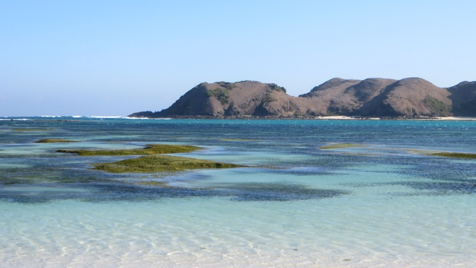
<figcaption>Von der Ebbe freigegebenes Seegras</figcaption>

Zurück im Bungalow gönnen wir uns an diesem Abend einen Cocktail und lassen die Erlebnisse der vergangenen Tage Revue
passieren – geteilte Freude ist ja bekanntlich doppelte Freude.
