Da ich mit meinem Blog wiedereinmal etwas hinterher bin, verabschiede ich mich lediglich mit ein paar Fotos von
Indonesien.

## Die reiche Kultur Balis

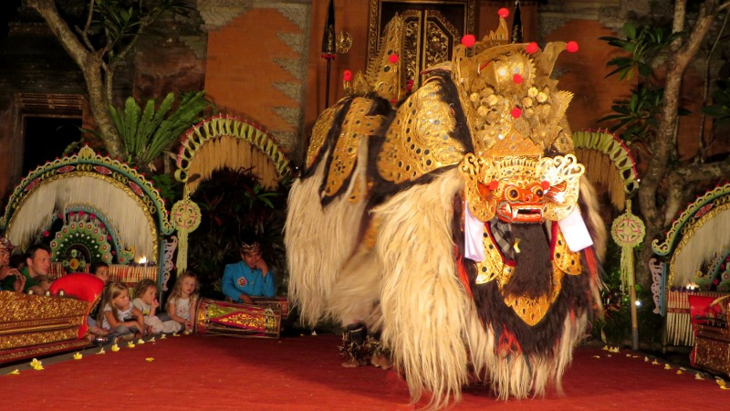
<figcaption>Monster aus dem traditionellen Barong-Tanz</figcaption>

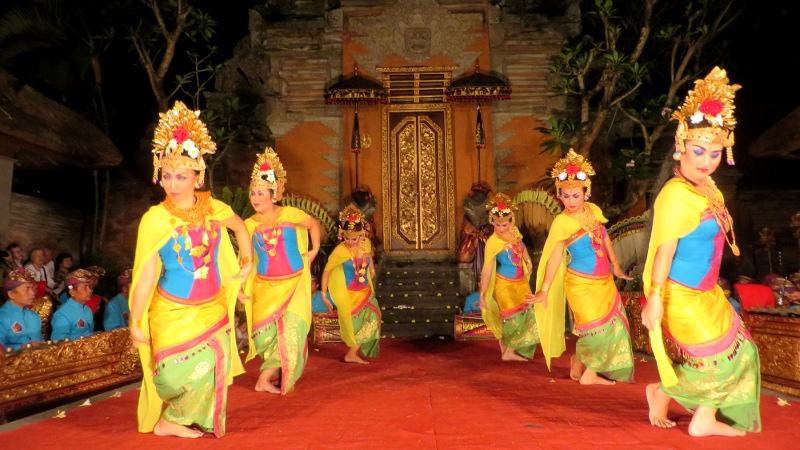
<figcaption>Traditionelle Legong-Tänzerinnen</figcaption>

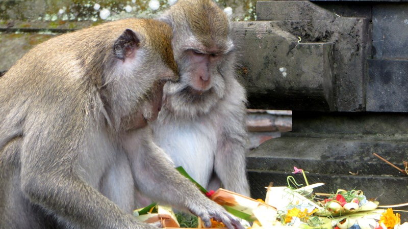
<figcaption>Mittagspause</figcaption>

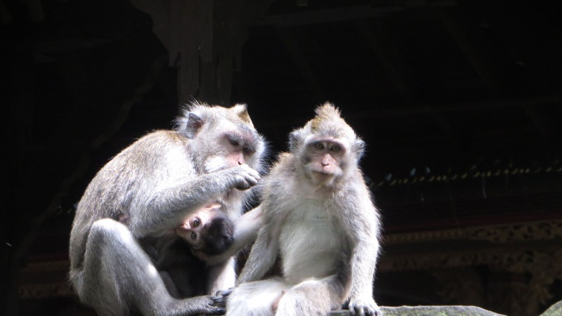
<figcaption>Körperpflege</figcaption>

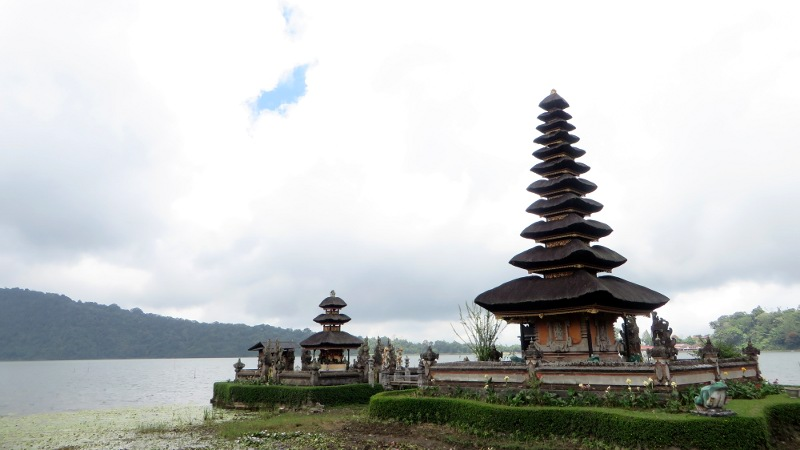
<figcaption>Der in den See gebaute Tempel von Bedugul</figcaption>

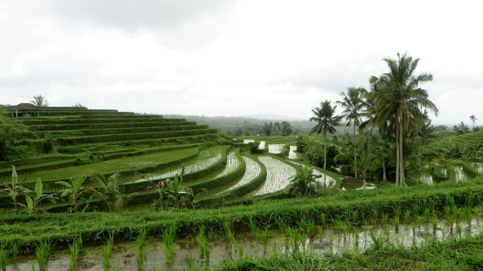
<figcaption>Die Reisterrassen von Jatiluwih</figcaption>

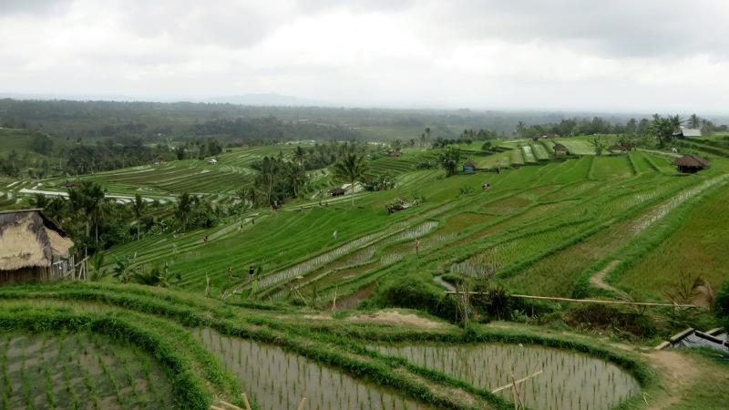
<figcaption>Die Reisterrassen von Jatiluwih</figcaption>

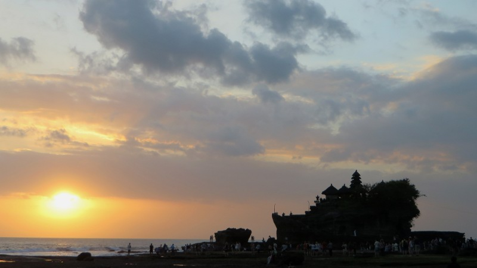
<figcaption>Der Tempel von Tanah Lot, der nur bei Ebbe erreichbar ist</figcaption>

## Menschen bei der Arbeit

Während meiner Zeit in Indonesien habe ich regelmässig Menschen beim Ausführen ihrer täglichen Arbeit fotografiert.
Hier sind einige dieser Fotos in Schwarzweiss:

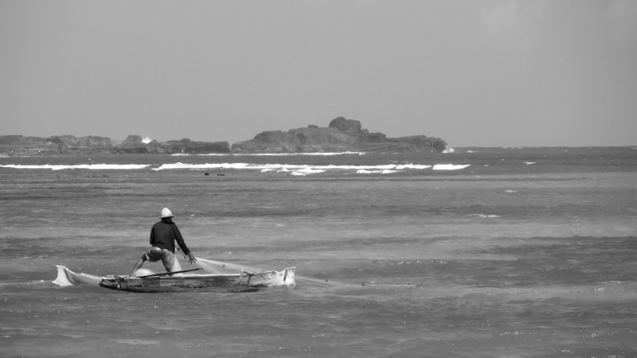
<figcaption>Fischer in Tanjung Aan</figcaption>

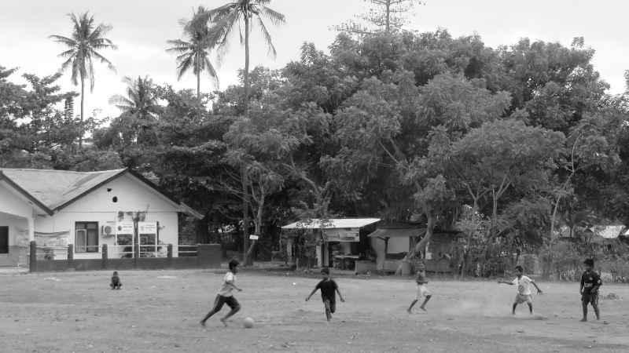
<figcaption>Schüler beim Fussballspiel auf Gili Air</figcaption>

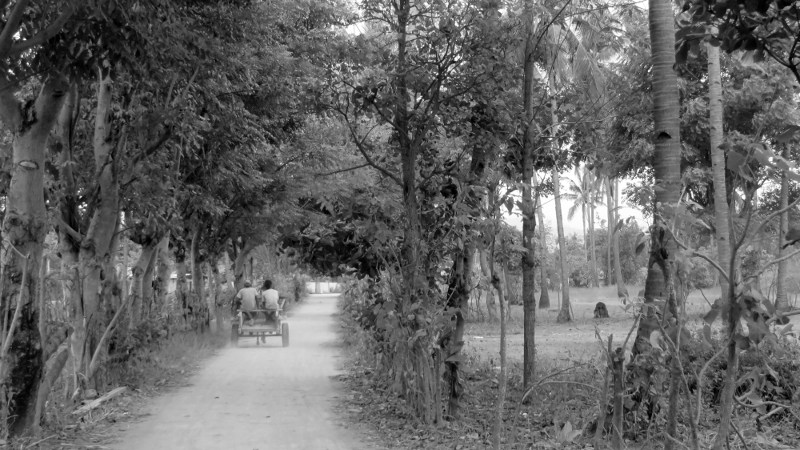
<figcaption>Bauern unterwegs auf Gili Air</figcaption>

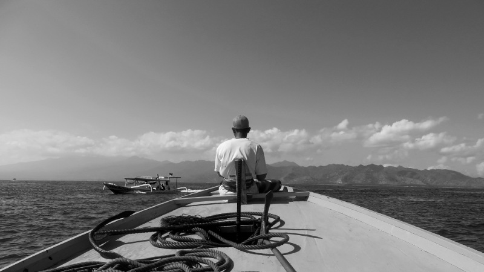
<figcaption>Bootsführer zwischen Gili Trawangan und Gili Air</figcaption>

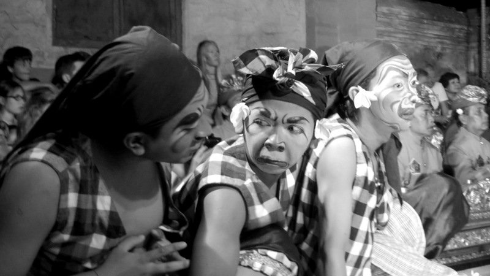
<figcaption>Schauspieler in Ubud</figcaption>

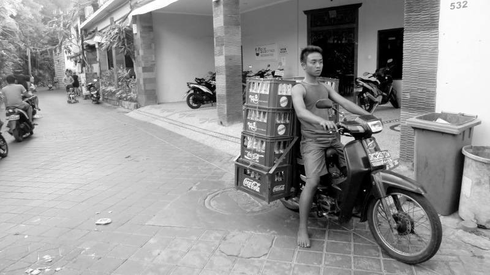
<figcaption>Zulieferer in Legian</figcaption>

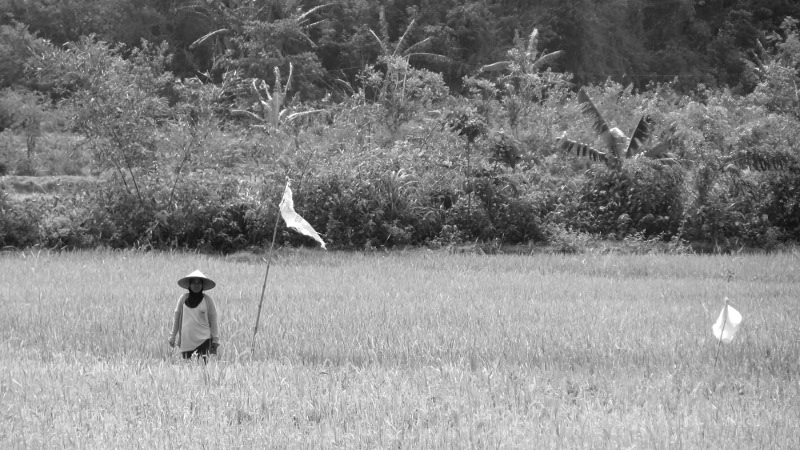
<figcaption>Reisbäuerin in Kuta Lombok</figcaption>

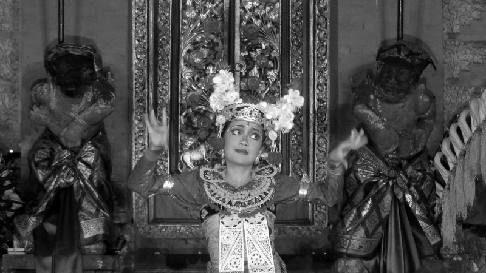
<figcaption>Legong-Tänzerin in Ubud</figcaption>
