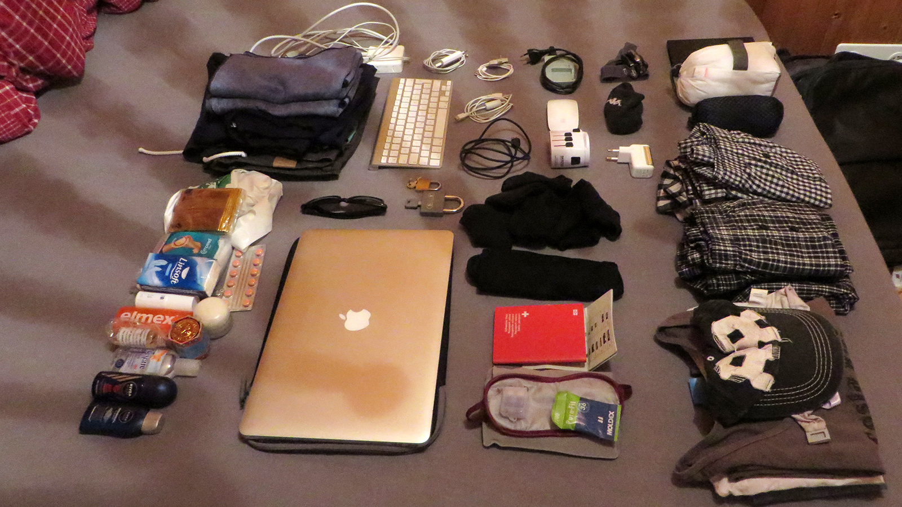
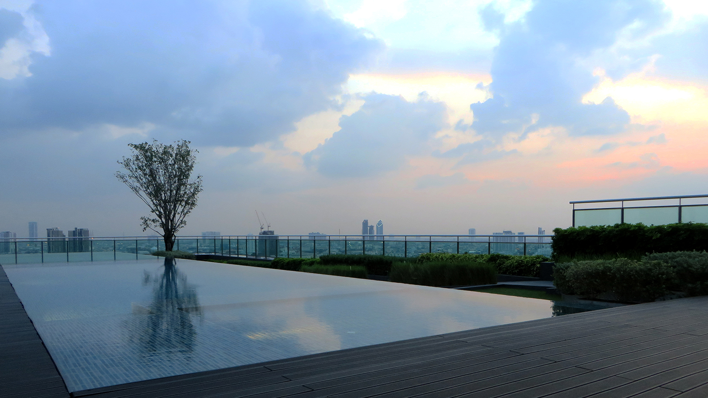
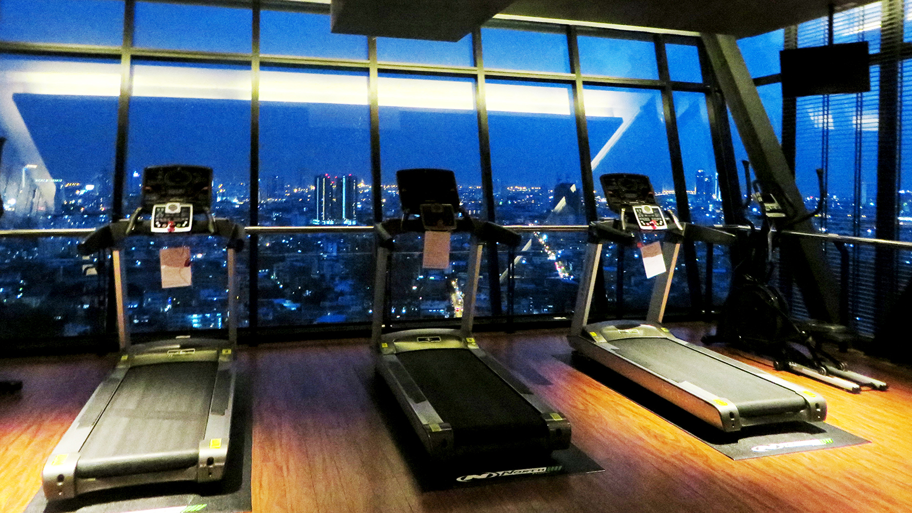
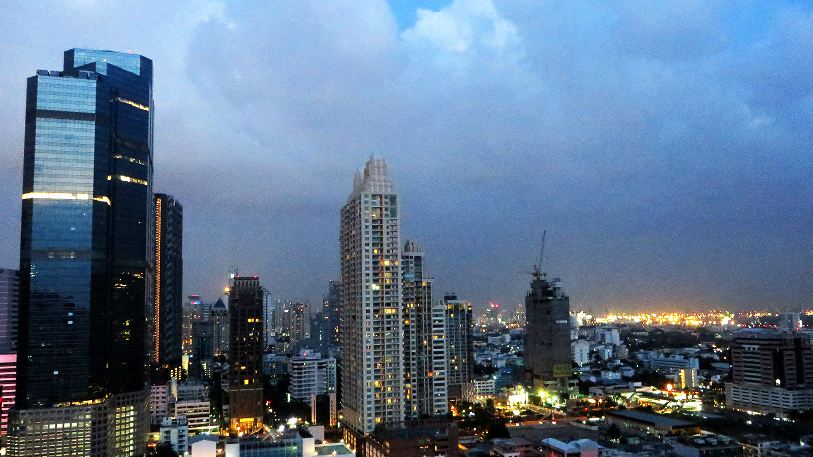

## Auf geht's!

Der 3. Dezember 2015 beginnt wie sehr viele Tage meiner Kindheit: Mit einem Sprint vom Haus meiner Eltern zur
Hauptstrasse, um den Bus Richtung Freiburg gerade noch zu erwischen. Diesmal allerdings, heisst das Ziel der Reise nicht
*Primarschule Lichtena*, sondern: [Bangkok](https://de.wikipedia.org/wiki/Bangkok).

Im Bus-Halbschlaf wird mir langsam bewusst, dass es jetzt tatsächlich wieder losgeht: Ich werde dem Schnee entfliehen
und den ganzen Winter über in Südostasien umherreisen – Zwischen den Visumsanträgen, Umzugskisten, Umarmungen und
Abschiedsessen der letzten Wochen hab ich das irgendwie nur unterbewusst realisiert. Aber jetzt gehts los. Langsam
überkommt mich dieses unbeschreibliche Gefühl, wenn du dein ganzes Leben in einen Rucksack gepackt hast und einfach
weggehst: Die absolute Freiheit!

<figcaption>Packen – Weniger ist mehr.</figcaption>

Meinen Rucksack habe ich übrigens seit dem letzten Mal etwas optimiert: Diesmal habe ich wirklich nur das Nötigste
eingepackt und reise nur mit Handgepäck – Davon erhoffe ich mir, wortwörtlich noch unbeschwerter reisen zu können (an
dieser Stelle vielen Dank an [Vedran](https://www.instagram.com/vdrnn/) für die zahlreichen Tipps!). Im Vergleich zu
meiner letzten Reise, gibt's ausserdem noch eine weitere Neuerung: Ich werde weiterhin meinem Job für
[weekend4two](http://www.weekend4two.ch/) nachgehn. Vielen Dank an die weekend4two-Jungs für diese Gelegenheit –
Hoffen wir also auf stabile Internetverbindungen!

Ansonsten ist alles wie gehabt: Ich bin getrieben von einer
riesigen Vorfreude auf neue Länder, unbekannte Sitten, verwirrende Sprachen, atemberaubende Natur, faszinierende
Kulturen und köstliches ungewohntes Essen. Mit dieser Vorfreude und meinem Rucksack besteige ich die Maschine der
*British Airways* in Genf.

## ยินดีต้อนรับสู่กรุงเทพฯ

Nach einem Abstecher nach [London](https://de.wikipedia.org/wiki/London) und 15 äusserst unbequemen Flugstunden, deren
trauriges Highlight ein ungeniessbares *English Breakfast* aus der Flugzeug-Mikrowelle darstellt, lande ich sicher in
Bangkok. Als ich
meinen ersten Fuss auf Thai-Boden setze, kann ich ob der extremen Luftfeuchtigkeit kaum mehr atmen. Sofort kommen
Erinnerungen an [Panama](http://ontheroad.alainhorner.ch/blog/20140413_hola_panama) auf – Und damit die Gewissheit, dass
ich mich bald daran gewöhnt haben werde. Die angenehmen 28° Celsius sind ausserdem ein willkommener Kontrast zur
schweizerischen Winterkälte von gestern (an die ich mich dank der mitgebrachten Erkältung nur zu gut erinnere).

Nachdem ich mir an einem Geldautomaten ein paar hundert [Baht](https://de.wikipedia.org/wiki/Baht)
geholt und erfolgreich eine Handvoll Taxifahrer abgewimmelt habe, sitze ich in der Metro Richtung Stadtzentrum.
Unterwegs bin ich überwältigt von der enormen Grösse Bangkoks: Während der 45-minütigen Fahrt vom Flughafen ins
Stadtzentrum ist man eigentlich immer in der Stadt!

<figcaption>Swimmingpool auf dem Dach</figcaption>

Schon fast traditionsgemäss hab ich mir für die ersten paar Tage ein luxuriöses Airbnb-Apartment gebucht, um den Jetlag
auszukurieren – Schnell den Rucksack in die Ecke stellen, duschen und auf zum hauseigenen Dachpool im 30. Stock, wo ich
die Sicht auf Bangkoks Bankenviertel [Sathon](https://de.wikipedia.org/wiki/Sathon) geniesse.

<figcaption>Fitnessraum – Hatte schon schlechtere Aussicht beim Joggen</figcaption>

Nach einer Weile löse ich mich schweren Herzens von dieser Aussicht. Ich gehe noch kurz raus um ein paar lebensnotwendige
Dinge wie Wasser und eine SIM-Karte zu besorgen, schlendere durch die Strassen und lasse mich in einem improvisierten
Strassenrestaurant mit Blechdach in einem *soi* (so werden kleine Seitenstrassen in Thailand genannt) nieder. Ich
bestelle eine in den
Worten des Kellners „leicht scharfe“ Suppe mit verschiedenen Meerestieren, von denen ich die meisten noch nie gesehn habe.
Die Suppe lässt mir das Augenwasser laufen und mich vergessen, dass ich je eine verstopfte Nase hatte. Einzig das kühle
Bierchen aus dem Hause *Chang* verspricht vorübergehend Linderung...

<figcaption>Sathon bei Nacht</figcaption>
