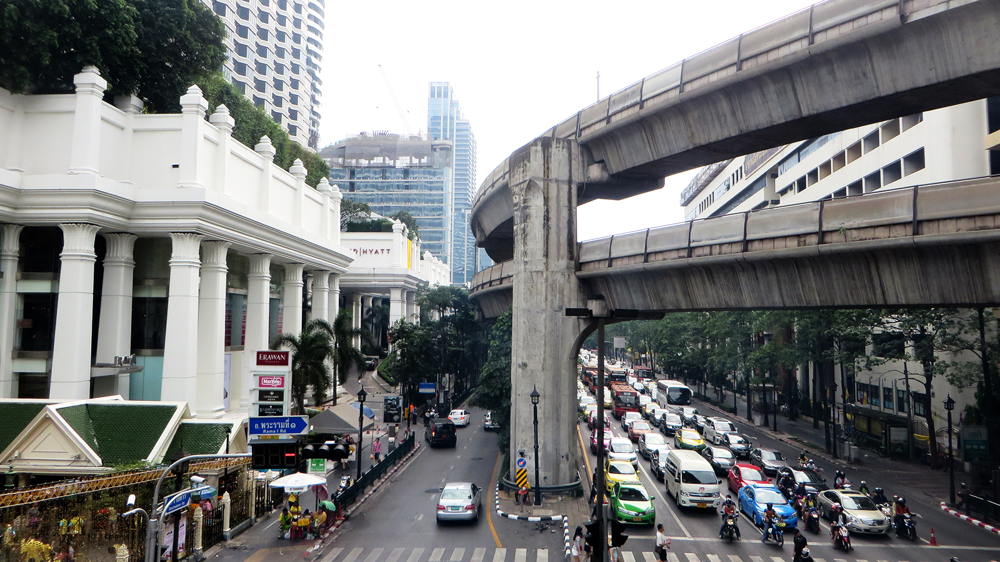
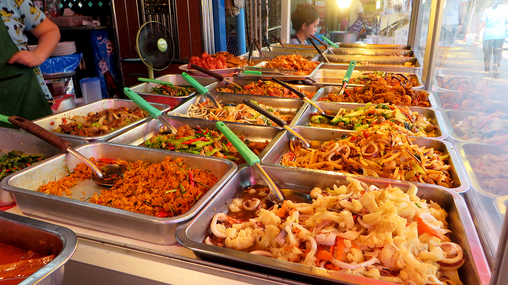
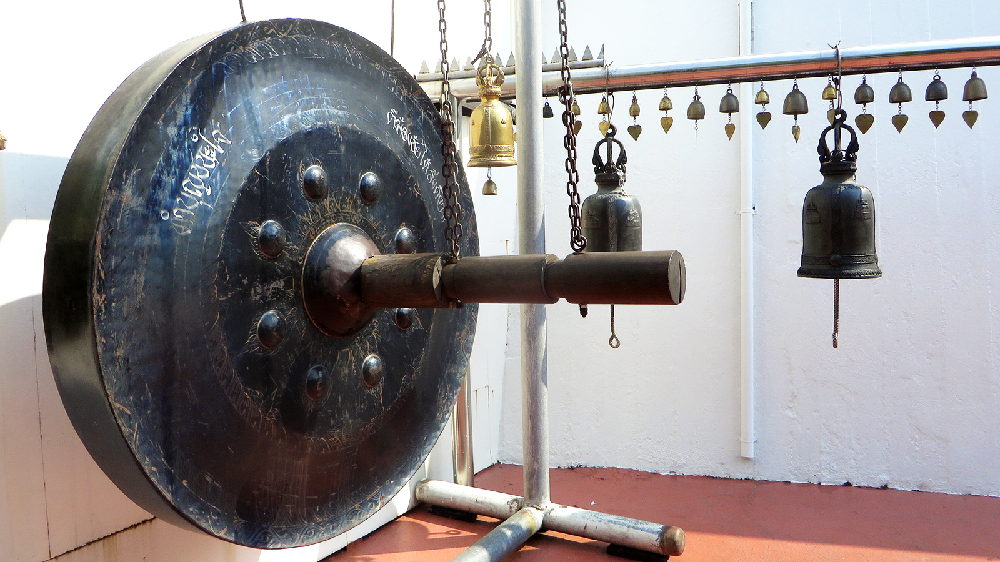
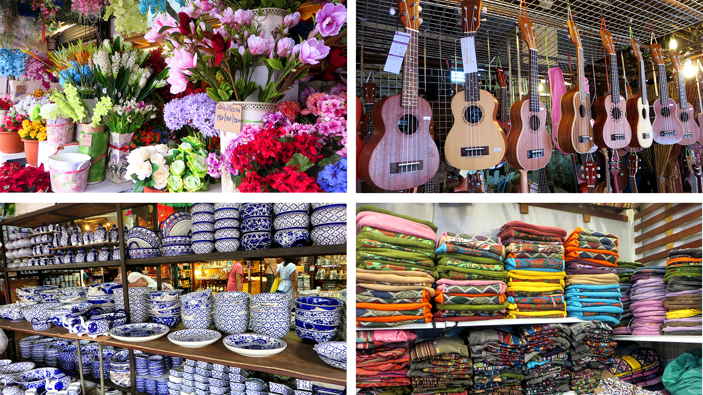
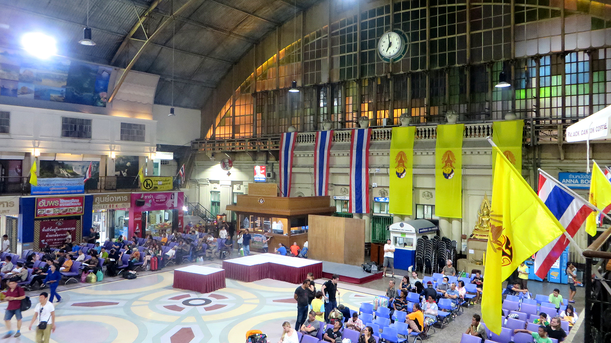
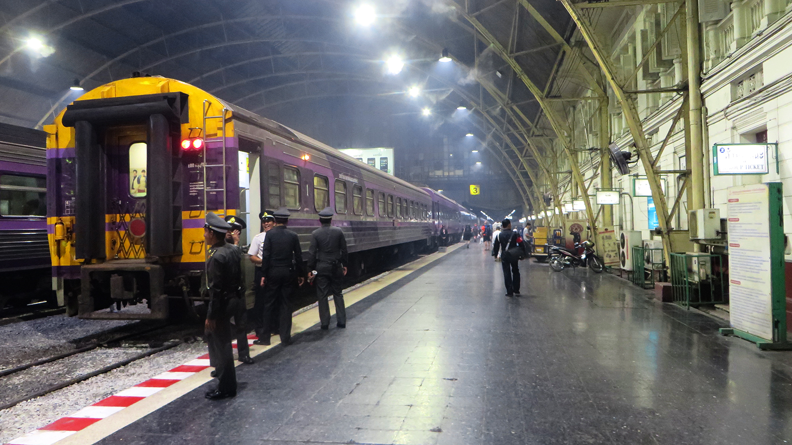
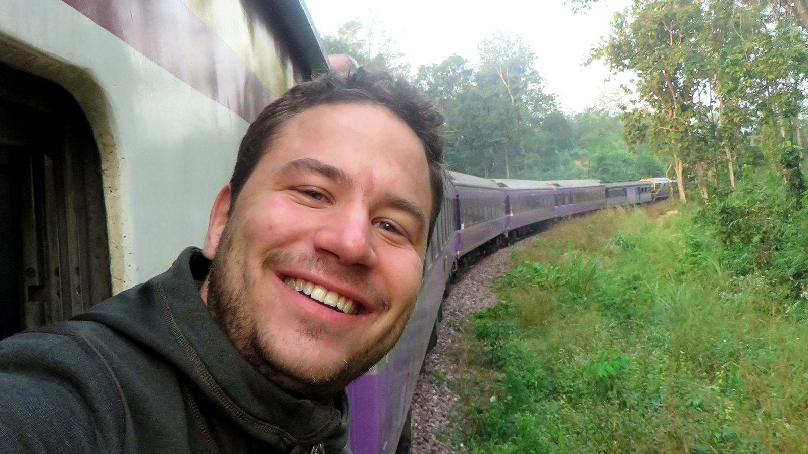

## Stadt der Engel

<figcaption>Zweistöckiger Sky-Train beim Erawan-Schrein</figcaption>

Nun ist es schon zwei Wochen her, seit ich in der *Stadt der Engel* (was der thailändische Name von Bangkok,
*Krung Thep*, wörtlich übersetzt bedeutet) angekommen bin.

<figcaption>Garküche in Bangkok</figcaption>

In dieser Zeit habe ich viel erlebt – In einem Satz zusammengefasst habe ich
unverletzt die lebensgefährlichen Strassen überquert,
viele Leute kennengelernt,
eine Thai-Rock-Band am hippen [Train Night Market](http://www.bangkok.com/shopping-market/rot-fai-market.htm) angehört (der Sänger hatte Stimme wie Kurt Cobain!),
verschiedene Tempel und Schreine (unter anderem den berühmten [Erawan-Schrein](https://de.wikipedia.org/wiki/Erawan-Schrein)) besucht,
eine erholsame Fussmassage und eine schmerzhafte Thai-Massage genossen,
die modernen Transportmittel [Sky-Train](https://de.wikipedia.org/wiki/Bangkok_Skytrain) und [Bangkok Metro](https://de.wikipedia.org/wiki/Bangkok_Metro) benutzt,
Bekannte getroffen,
mich über die extrem jung aussehenden Thais gewundert (zwischen 20 und 45 ist es praktisch unmöglich, ihr Alter einzuschätzen),
viel erfrischenden [Thai-Tee](https://en.wikipedia.org/wiki/Thai_tea) getrunken,
zahlreiche Märkte besucht (man kann auf den Märkten von lebenden Hühnern über Möbel bis zu Motorrollern alles kaufen),
die Gerüche Bangkoks inhaliert (es stinkt hier wie in jeder Grossstadt, aber es ist doch irgendwie anders, denn es riecht immer auch nach köstlichem Essen),
erfolgreich die verschiedensten Angebote an der [Khaosan Road](https://en.wikipedia.org/wiki/Khaosan_Road) abgelehnt,
erste Thai-Wörter gelernt,
die fiesen Tricks der [Tuktuk-Fahrer](https://de.wikipedia.org/wiki/Autorikscha) durchschaut,
mich in das strahlende Lächeln der Thais verliebt,
ein Konzert des Bangkok Orchesters im [Lumphini-Park](https://de.wikipedia.org/wiki/Lumphini-Park) angeschaut,
die Aussicht von einer [Sky Bar](https://en.wikipedia.org/wiki/Sirocco_(restaurant)) genossen,
den Provinz-Bus benutzt (ein Busticket zu einer Ortschaft, die man nicht aussprechen kann bei einer Kondukteurin, die kein Wort Englisch spricht zu kaufen, ist garnicht so einfach!),
zahlreiche köstliche Thai-Gerichte probiert,
der Nationalhymne gelauscht (in Thailand wird täglich zweimal an allen öffentlichen Orten die Nationalhymne gespielt, worauf sich alle Leute erheben / stehen bleiben)
und viel leckeren thailändischen Kaffee getrunken.

<figcaption>Gong beim Tempel des Goldenen Berges (Wat Saket)</figcaption>

Nun ist es also bereits an der Zeit, diese verrückte Stadt zu verlassen – Das macht mir aber überhaupt nichts aus, denn
ich weiss, dass ich zurück sein werde.

<figcaption>Impressionen vom Chatuchak Wochenendmarkt</figcaption>

## Nachtzug nach Chiang Mai

Ich sitze in einem Strassenrestaurant am Bahnhof *Hua Lamphong* von Bangkok und geniesse gerade eine köstliche Schale
*Tom yam kung* (scharfe thailändische Garnelensuppe), als ich nebenbei auf die Uhr schaue und erschreckt feststelle,
dass ich wie so oft schon in Thailand völlig die Zeit vergessen habe: Scheisse, schon 19:31 - In fünf Minuten fährt mein
Zug! Obwohl ich nicht unbedingt damit rechne, dass der Zug pünktlich losfährt, knalle ich ein paar *Baht* auf den Tisch,
packe meinen Rucksack und renne durch das abendliche Verkehrschaos und die Bahnhofhalle zu den Geleisen.

<figcaption>Bahnhofhalle in Hua Lamphong</figcaption>

Bei den Geleisen ankommend stelle ich fest, dass scheinbar nicht mit einer Verspätung zu rechnen ist, denn die Diesel-Lok
(übrigens ein Second-Hand-Objekt aus Schweden) schnurrt schon abfahrtbereit. Unter den Anfeuerungsrufen der Schaffner
(„*Quick, quick, my friend!*“) renne ich dem Zug entlang und springe auf meinen Wagen auf, bevor sich der Zug pünktlich
in Bewegung setzt.

Ich suche meine Schlafkabine der zweiten Klasse (wollte zuerst in der 3. Klasse reservieren, aber 12 Stunden auf einem
Holzstühlchen zu verbringen war mir dann doch etwas zuviel des Abenteuers) und mache dort die Bekanntschaft einer netten
Ami-Thai-Familie, die über die Feiertage Verwandte in der Region besucht. Während sich der „Express-Zug“ in
gefühltem Schritttempo Richtung Norden aufmacht, sprechen wir an diesem amüsanten Abend über Gott und die Welt, speziell
über die Welt der Käfer und Busse aus dem Hause VW („*Wolcswäigen*“, wie er's ausspricht) von denen der Vollblutsammler
bereits über 20 Stück angehäuft hat!

<figcaption>Vor der Abfahrt...</figcaption>

Natürlich ist jeder Tage einmal Abend. Ich putze rasch meine Zähne in einem „Badezimmer“, in dem man eigentlich
nicht mal seinen Hund zur Toilette schicken möchte und danach geht's ab in's Bett. Während ich auf der eher unbequemen
Schaumstoffmatratze im oberen Kajütenbett einzuschlafen versuche, blicke ich auf meine Zehen, die gerade noch vor der
Kabinenwand aufhören und denke an meine etwas grösseren Freunde, die hier wohl mit angewinkelten Beinen schlafen
müssten.

<figcaption>Zugfahrt nach Nordthailand</figcaption>

Nach einer mittelmässig erholsamen Nacht stehe ich auf und kaufe bei einer Händlerin einen heissen Kaffee – Auch im
Zug gibt's in Thailand zahlreiche Möglichkeiten, Essen und Trinken zu erstehen. Ich setzte mich an's Fenster und
geniesse die phänomenale Aussicht von der kurvigen Zugstrecke auf das Grün Nordthailands: Dschungel, Weiden,
Reisfelder, Bananenplantagen. Ich schlürfe noch verträumt meinen Kaffee, während die ersten Häuser von Chiang Mai's
Vororten neben den Geleisen auftauchen...
