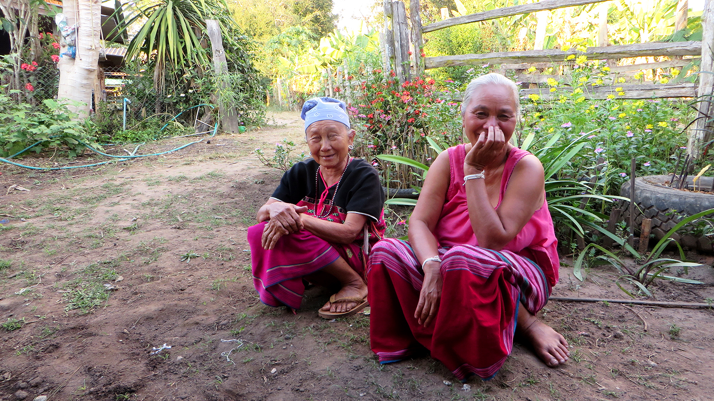
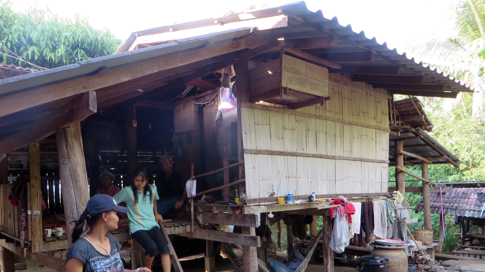
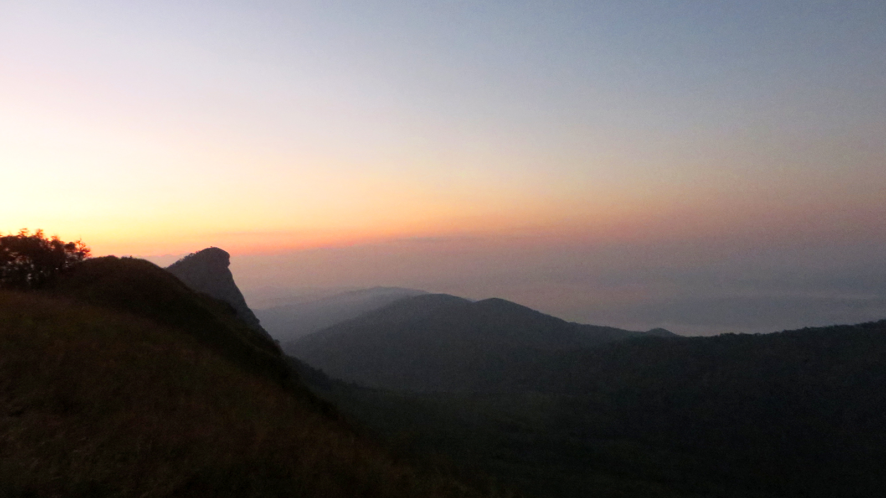
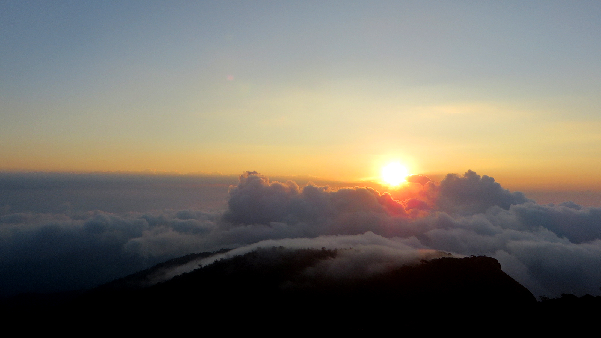
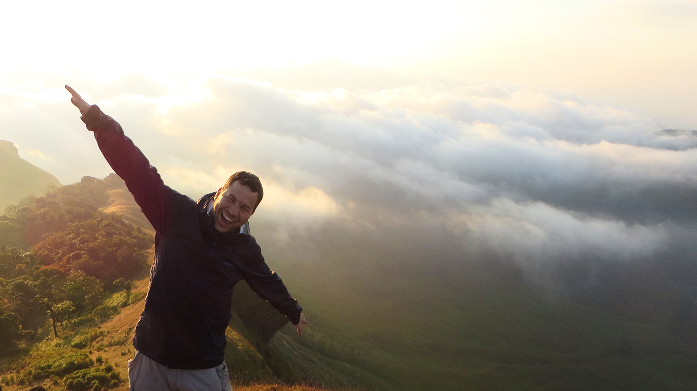
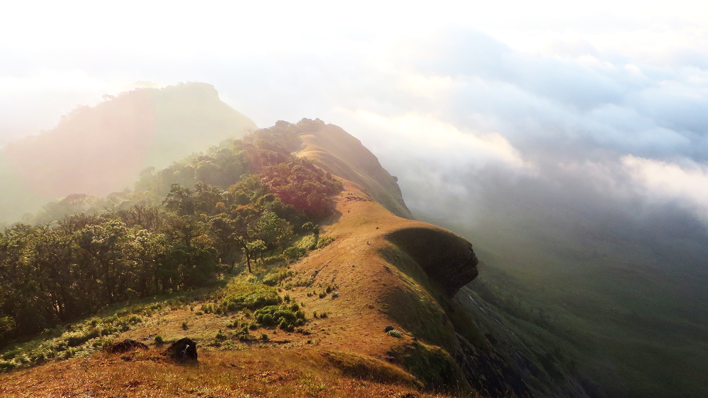
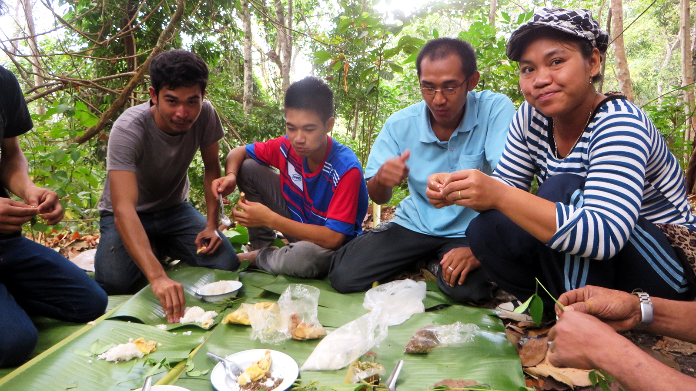
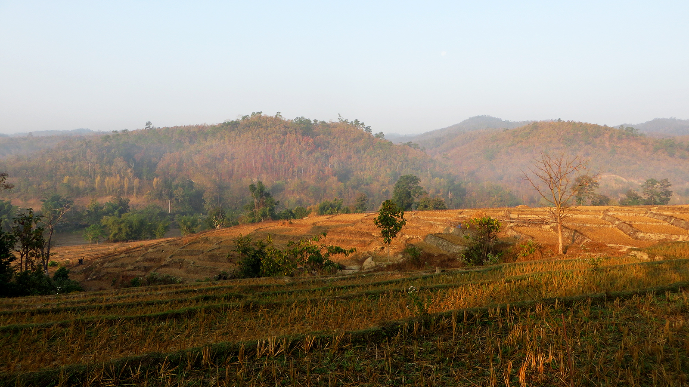
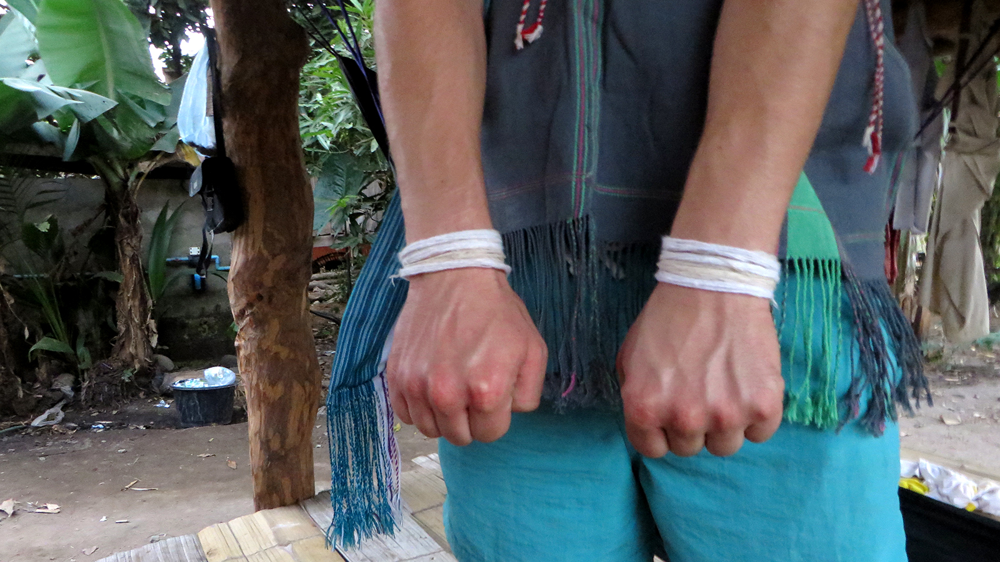
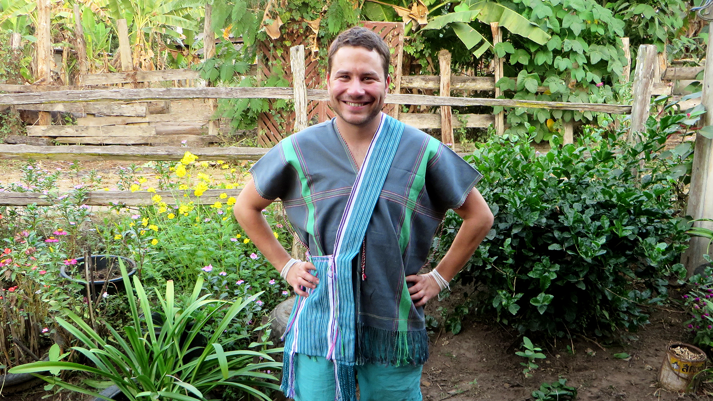

Es ist halb fünf Uhr morgens, als jemand an meinem Zelt rüttelt und ruft: „Alan, wake up, we need go!“. Obwohl ich
nicht gemeinhin als Morgenmensch bekannt bin, fällt mir das Aufstehen heute sehr leicht – Zu unbequem und
(erstaunlicherweise) kalt war die vergangene Nacht im Zelt.

<figcaption>Fröhliche Karen-Frauen in traditioneller Tracht</figcaption>

Ich befinde mich irgendwo in den Bergen des Bezirks *Omkoi* in Nordthailand. Zusammen mit einer Gruppe von Einheimischen
aus dem [Karen-](https://de.wikipedia.org/wiki/Karen_(Volk))Dorf *Huay-Mai-Hok* will ich mir heute den Sonnenaufgang
auf dem [Doi Mon Jong](https://www.google.co.th/search?q=doi+mon+jong&biw=1440&bih=754&source=lnms&tbm=isch&sa=X&ved=0ahUKEwixgdKb14rKAhXQxY4KHYcBDcEQ_AUIBigB),
dem höchsten Berg der Region, ansehn. Nach einem ausgewogenen Frühstück (Reis, Poulet und Nudelsuppe,
selbstverständlich auf dem Feuer zubereitet) setzt sich der Trupp in Bewegung.

<figcaption>Karen-Haus</figcaption>

Seit einigen Tagen bin ich nun zu Besuch in Huay-Mai-Hok um *Angs* (das ist ihr „verwestlichter“ Name – Ihren richtigen
Namen kann ich leider nicht aussprechen, geschweige denn schreiben) Familie zu besuchen. Huay-Mai-Hok wird
hauptsächlich von Angs Cousins und Cousinen verschiedener Grade bewohnt (Anm. d. Red.: bei den Karen verlässt traditionsgemäss der
Mann bei der Hochzeit sein Dorf, um mit der Familie der Ehefrau zu leben, d.h. die Verwandschaften im Dorf sind fast immer
mütterlicherseits). Dazu eingeladen haben mich Ang und ihr Mann übrigens spontan, als ich nach einer kurzen Bekanntschaft in
einem Nebensatz erwähnt hatte, dass ich die Bergvölker Nordthailands schon noch interessant finde – Dass dies erst
ein Vorgeschmack der Karen-Gastfreundschaft war, sollte ich noch früh genug erfahren.

<figcaption>Doi Mon Jong beim Sonnenaufgang</figcaption>

Die verschiedenen Karen-Stämme stammen ursprünglich aus der Region Tibets und leben hauptsächlich in [Myanmar](https://de.wikipedia.org/wiki/Myanmar), ein Teil
von ihnen aber auch im Norden Thailands. Sie haben eine lange Geschichte als Flüchtlinge, da sie schon in vorkolonialer
Zeit regelmässig verfolgt und vertrieben wurden. Auch heute kommt es in Myanmar noch zu Zwangsumsiedelungen von
Karen-Stämmen. Das generationenlange Wandern hat in den Karen-Stämmen zu einem einzigartigen religiösen und
kulturellen Mix und allerhand interessanten Traditionen geführt, von denen ich nun nach und nach Zeuge werde, aber nur
knapp die Hälfte verstehe.

<figcaption>Sonnenaufgang</figcaption>

Unter der Führung von Angs Onkel wandern wir durch Wälder, Wiesen und Gebüsche, wobei er uns
teilweise mit einer Machete den Weg durch das Dickicht bahnt. Man merkt dem rüstigen Siebzigjährigen an, dass er
viel Zeit in der Natur verbracht hat: Alle paar Minuten sprint er ins Dickicht und kommt mit irgendeiner essbaren
Pflanze zurück. Einige schmecken gut, andere scheusslich – Er schwört aber, dass sie gut für die Gesundheit seien.
Der Gipfel dieser Probier-Tour ist ein Stück abgeschnittener Rinde eines Baumes, dessen Harz wie Sportusal
schmeckt. Er erklärt mir, dass er das Harz zur Regenerierung auf müden Beinen einreibt – Daher kommt das also!

<figcaption>Auf dem Doi Mon Jong</figcaption>

Etwas verschwitzt (trotz der nächtlichen Kälte ist es immernoch ziemlich feucht), erklimmen wir endlich den Gipfel.
Gerade rechtzeitig, denn schon steigt die Sonne am Horizont auf und gibt einen atemberaubenden Blick auf eine
Hügel- und Berglandschaft frei, die im nicht allzu fernen Westen bereits zum Staatsgebiet von
Myanmar gehört. Bemerkenswert sind auch die Formen der nahe gelegenen
Gipfel *denkender Affe* und *Löwenkopf*, obwohl es doch einer Portion Fantasie bedarf, um darin Tiere zu erkennen.

<figcaption>Löwenkopf</figcaption>

Nachdem wir das Erklimmen des Doi Mon Jong mit einem Gläschen selbstgebranntem Reisschnaps gefeiert haben, nehmen
wir den Rückweg des langen Weges von gestern in Angriff. Diese Rückreise endet in Huay-Mai-Hok, dem Dörfchen, in dem
ich seit einigen Tagen zu Gast bin.

<figcaption>Mittagspause</figcaption>

Huay-Mai-Hok ist etwas anders, als die Dörfer, die ich aus der Schweiz gewohnt bin: Alles ist sehr einfach und
rustikal, das Wohnzimmer ist eine offene Holzveranda, WC und Dusche bedient man mit einem Wasserkessel und überall
laufen Haustiere / Essensvorräte frei herum (die Leute hier sind grösstenteils Selbstversorger).
Es gibt aber seit einigen Jahren Strom und somit elektrisches Licht (ein Geschenk des thailändischen Königs).
Ach ja, und ich bin erst der 5. [Farang](https://de.wikipedia.org/wiki/Farang) (so werden in Thailand Weisse
genannt), der das Dorf besucht. Entsprechend gross ist auch das Interesse an mir: Alle sind sehr nett zu mir und
wollen mit mir sprechen - Was sich wegen mangelnder Sprachkompatibilität natürlich nicht ganz einfach gestaltet.
Sogar wenn ich mehr als drei Wörter Thäiländisch sprechen könnte, würden wir übrigens das gleiche Problem haben,
denn die Karen-Stämme haben ihre eigenen Sprachen und nur die letzten zwei der vier hier lebenden Generationen haben
Thailändisch in der Schule gelernt.

<figcaption>Ausgetrocknete Reisfelder in Huay-Mai-Hok</figcaption>

Nachdem wir uns auf der Veranda etwas von unserer Wanderung erholt haben, wird zum Abendessen gerufen. Da dies mein
letzter Abend in Huay-Mai-Hok ist, gibt's heute ein Festessen (was mir etwas unangenehm ist). Zu diesem Zweck hat
sich das halbe Dorf im Haus eingefunden. Zuerst werde ich aber Zeuge einer interessanten Tradition: die Dorfältesten
knüpfen für alle Anwesenden Armbändchen, die zu einem merkwürdigen Singsang angelegt werden und uns von Geistern
befreien und Glück bringen sollen. Als das Ganze zu Ende ist, trage ich rund zwanzig Bändchen an meinen Armen - Da kann
ja garnichts mehr schiefgehn.

<figcaption>Traditionelle Armbändchen</figcaption>

Nun wird gegessen, was ein Erlebnis für sich ist: Zwanzig Leute sitzen auf einem Teppich am Boden und essen aus
unzähligen Schälchen und Schüsselchen Reis, Suppe und allerhand köstliche Dinge, von denen ich keine Ahnung habe,
was es überhaupt ist. Eigens für's heutige Abendessen wurden mehrere Hühner geschlachtet, von denen alles ausser den
Knochen gegessen wird (zu den Füssen kann ich mich noch überwinden, bei den Eingeweiden muss ich dann aber doch
passen). Dazu wird Reisschnapps rumgegeben (aus irgendeinem Grund gibt's nur ein einziges Glas, weshalb Ahngs Bruder
während des ganzen Essens nichts anderes macht als nachzuschenken und das Glas weiterzugeben). Nach dem Essen gönnt
man sich wahlweise eine in Bananenblätter gerollte Zigarre mit Tabak aus dem Garten (ich passe) oder einen
merkwürdigen Teeblätter-Snus (ich probiere und bereue). Danach wird aus den Hühnerbeinknochen die Zukunft vorausgesagt,
bevor ich zur Krönung meines Aufenthalts eine traditionelle, handgewebte Karen-Tracht geschenkt bekomme - Wow, ich
bin gerührt!

<figcaption>Das Karen-Äquivalent zum Edelweisshemd</figcaption>

Nach dem Festmahl heisst es Abschied nehmen. Abschied nehmen bedeutet: viele Worte die ich nicht verstehe und noch
mehr herzliche Umarmungen. Angs Mutter sagt, ich sei jederzeit wieder willkommen in Huay-Mai-Hok, ich gehöre jetzt
schliesslich zur Familie - Und das Lächeln, das sie dabei auf dem Gesicht hat, lässt einen glauben, dass das mehr
ist, als nur ein Bonmot.
