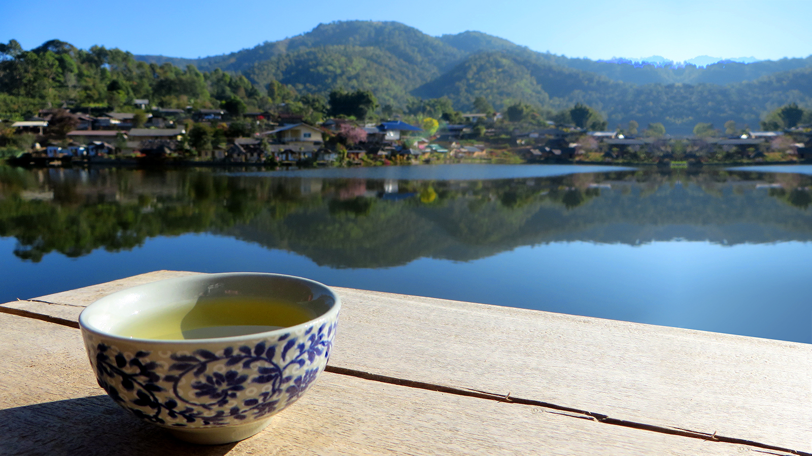
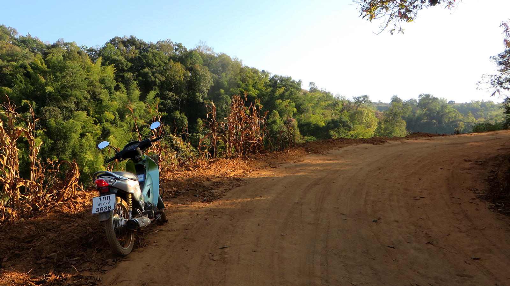
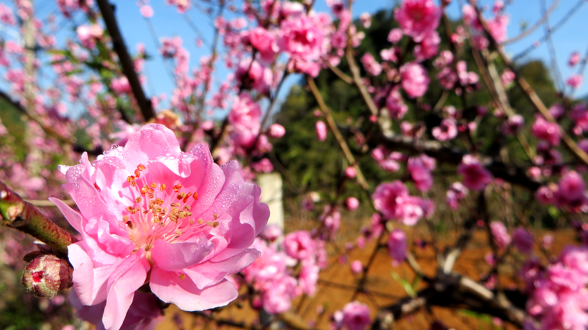
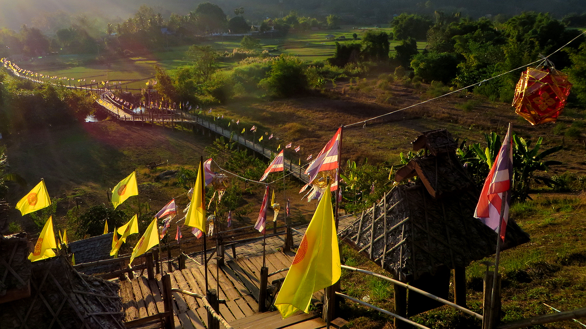
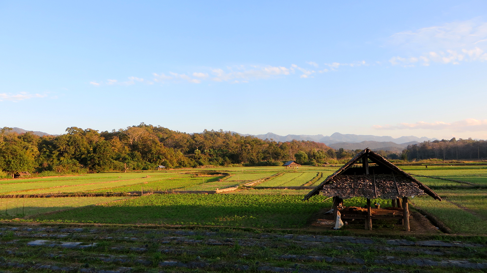
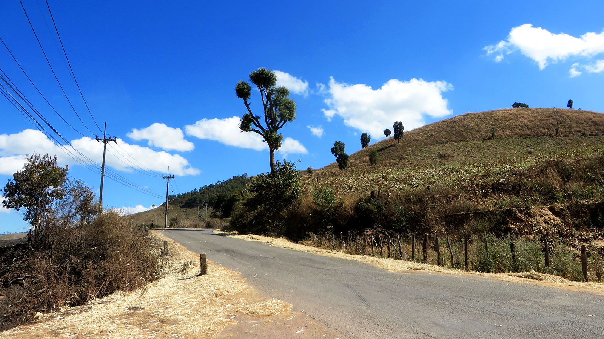
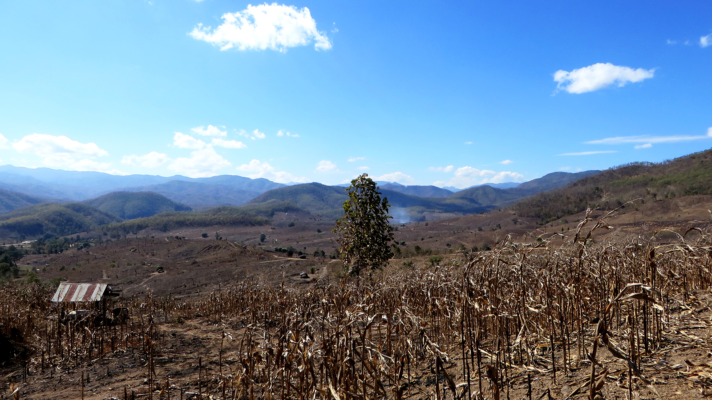
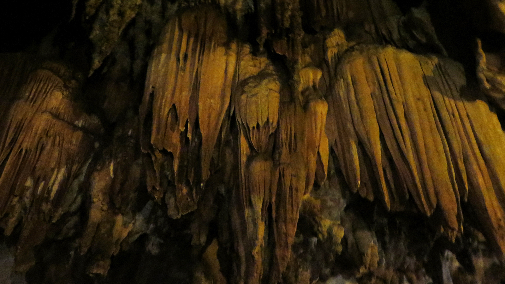
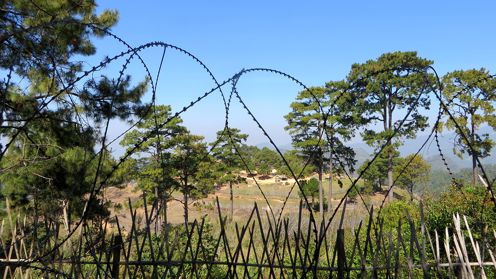
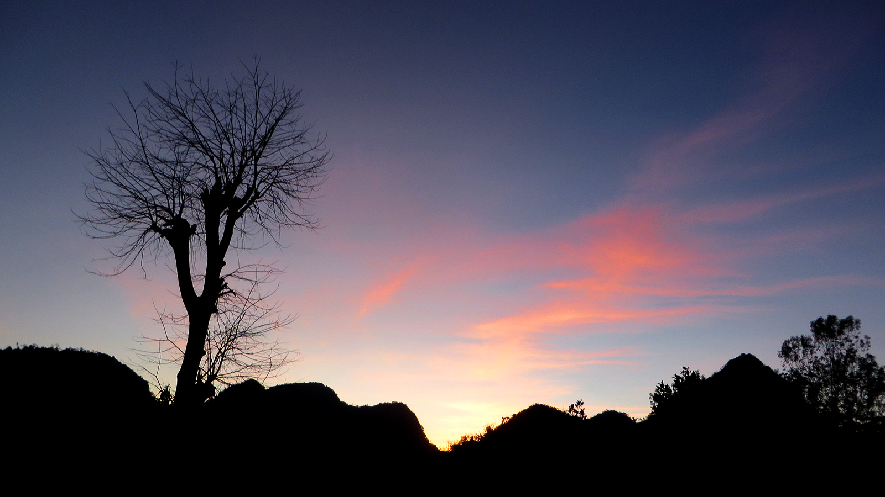

<figcaption>Ban Rak Thai – Ein Hauch von China</figcaption>

An diesem kühlen Januarmorgen sitze ich an einem kleinen Tischchen am Seeufer von *Ban Rak Thai* und
schlürfe köstlichen [Ginseng](https://de.wikipedia.org/wiki/Ginseng)-Tee aus einem kleinen Becherchen.
Wüsste ich es nicht besser, würde ich mich in China wähnen: Der Tee, die Leute, die Dekoration, die
Architektur – Alles fühlt sich irgendwie chinesisch an. Dies ist kein Zufall, denn Ban Rak Thai wurde von
nationalistischen Flüchtlingen aus [Yunnan](https://de.wikipedia.org/wiki/Yunnan) Mitte 20. Jahrhundert
gegründet, nachdem diese den Kommunisten im [Chinesischen
Bürgerkrieg](https://de.wikipedia.org/wiki/Chinesischer_B%C3%BCrgerkrieg) unterlagen. Obwohl das Dorf
politisch zu Thailand gehört, hat es dank den immernoch hauptsächlich aus Yunnan stammenden Bewohnern also
einen starken chinesischen Touch.

<figcaption>Unterwegs nach Pai</figcaption>

Ich befinde mich momentan auf einer Motorradtour durch Nordthailand. Die vergangenen Tage habe ich deshalb
hauptsächlich im Sattel eines gemieteten [Honda Wave](https://de.wikipedia.org/wiki/Honda_Innova) (nach
dem VW Käfer übrigens das am zweithäufigsten gebaute Kraftfahrzeug der Geschichte) verbracht. Mein bisheriger
Weg hat mich auf einer überfüllten Schnellstrasse von Chiang Mai nach [Chiang
Dao](https://de.wikipedia.org/wiki/Amphoe_Chiang_Dao), über steile Pässe an die burmesische
Grenze im abgelegenen [Ang Khang](https://en.wikipedia.org/wiki/Doi_Ang_Khang), durch verschlafene Dörfer in
das Hippie-Dorf [Pai](https://de.wikipedia.org/wiki/Amphoe_Pai) und über weitere Pässe und weite
Landstrassen schlussendlich in die nordwestlichste Provinz Thailands, [Mae Hong
Son](https://de.wikipedia.org/wiki/Mae_Hong_Son) geführt. Die abenteuerlichste Strecke bisher war ohne Zweifel
die ungeteerte Strecke zwischen Chiang Dao nach Pai: Die „Abkürzung“ hat mich durch entlegene Dörfer und einige
Flüsse (ja, wirklich *durch* die Flüsse, es hatte nicht immer Brücken) geführt und die Strasse war oft eher
ein Wanderweg. Ziemlich lustig war auch die Kreuzung mit zwei identisch aussehenden Strassen und thailändischen
Wegweisern irgendwo im Nirgendwo (mangels Publikum und Telefonsignal habe ich mich für den „50-50-Joker“
entschieden).

<figcaption>Sakura-Blüte</figcaption>

Ich trinke meinen Ginseng-Tee aus, ziehe alle meine mitgebrachten Kleider an (es ist nur ca. 10 Grad warm) und
setze mich auf's „Töffli“, wie ich das leichte Motorrad für mich nenne. Während der Tau auf den
[Sakura](https://de.wikipedia.org/wiki/Japanische_Kirschbl%C3%BCte)-Blüten langsam von der Wintersonne
getrocknet wird, mache ich mich auf Richtung Süden.

<figcaption>Sutongpe-Brücke</figcaption>

Während ich versuche, immer schön auf der linken Strassenseite zu bleiben,
bieten sich mir (neben der atemberaubenden Natur) immer wieder ungewohnte Bilder: Ein Pickup voller
Schulkinder auf der Ladefläche. Ein ganz in orange gekleideter Mönch, der auf den Bus wartet. Ein Motorrad
mit einer vierköpfigen Familie drauf. Ein Transporter, der mit so viel Gemüse beladen ist, dass die Aufhängung
völlig durchgedrückt ist. Hühner, die im letzten Moment vor dem herannahenden Motorrad flüchten.

<figcaption>Reisfelder in Mae Hong Son</figcaption>

Obwohl ich nur kurz für's Mittagessen ([Tom Yam Kung](https://de.wikipedia.org/wiki/Tom_Yam)) und für einen
Nachmittagskaffee anhalte, erreiche ich Chiang Mai erst in der Abenddämmerung – Mit 400 Kilometern war dies
die längste Etappe der Motorradtour. Ich bin müde und auch erleichtert, dass ich dieses Strassenabenteuer
unbeschadet überstanden habe. Die kluge (sprich *sichere*) Art, Nordthailand zu bereisen wäre wohl per Bus
gewesen, denn Thailands Strassen gehören zu den
[gefährlichsten](http://www.zukunft-mobilitaet.net/33215/analyse/verkehrssicherkeit-verkehrstote-weltweit-ranking-who/)
überhaupt: Schlaglöcher so gross wie Kleinwagen, Strassen mit bis zu 20% Gefälle, Haarnadelkurven, streunende
Hunde. Verrückte Fahrer, die bei Gegenverkehr oder in unübersichtlichen Kurven überholen, runden den
gefährlichen Mix ab.

Naja, klug war's nicht... Aber geil!

<figcaption>In den Bergen von Mae Chaem</figcaption>

<figcaption>Brandrodung in der Region Mae Chaem</figcaption>

<figcaption>Tropfsteinhöhle in Chiang Dao</figcaption>

<figcaption>Grenzzaun zu Myanmar</figcaption>

<figcaption>Sonnenuntergang in Ang Khang</figcaption>
