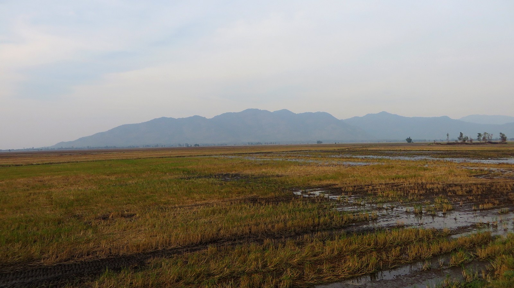
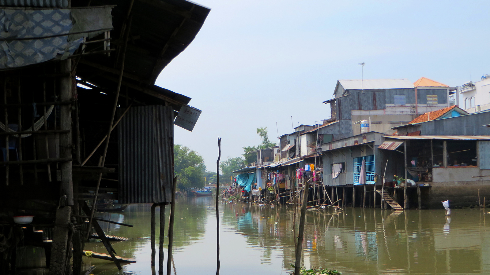
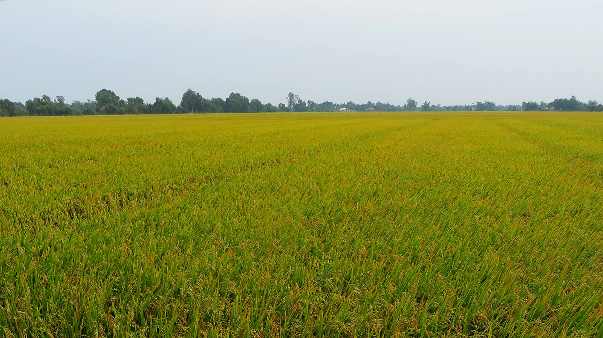
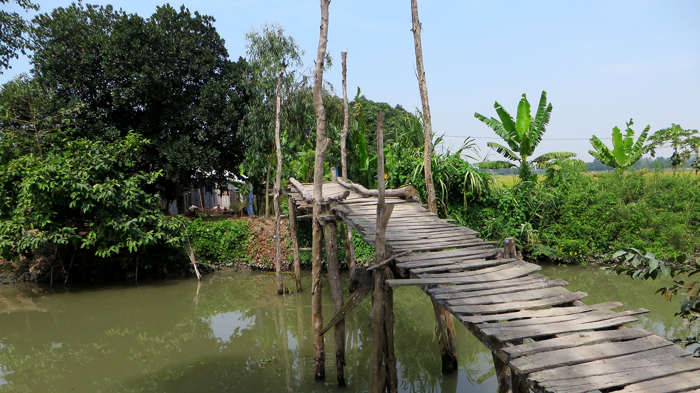
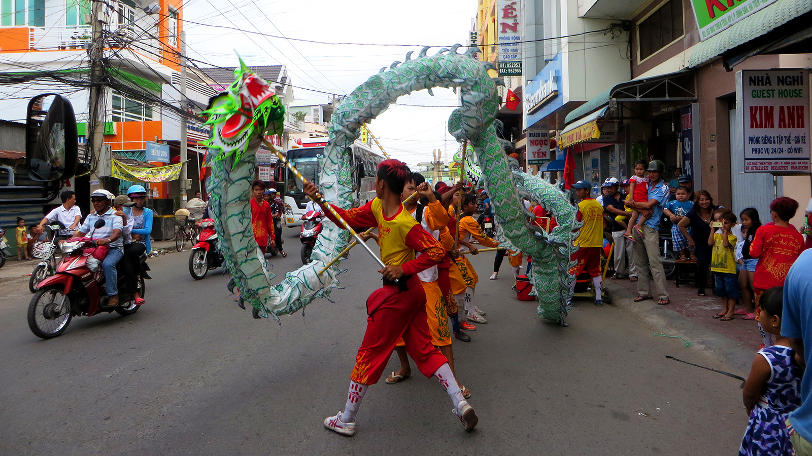
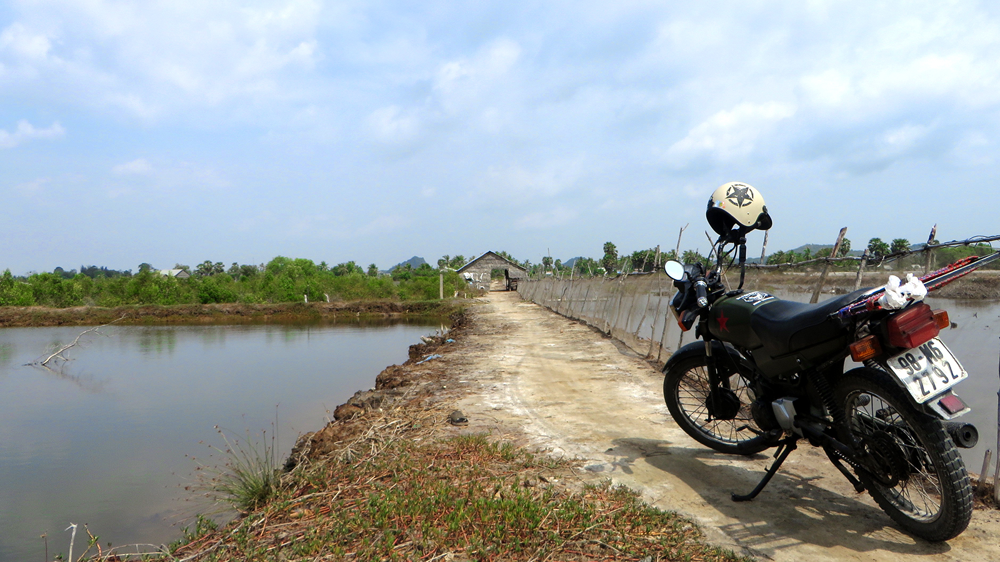
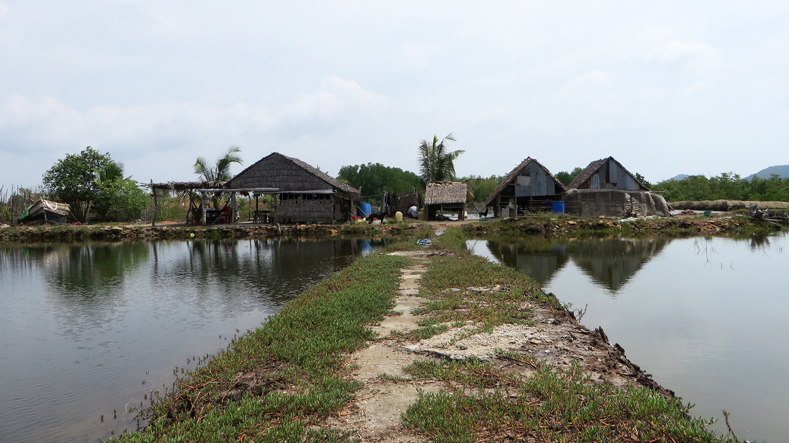

Eigentlich wäre der „Plan“ ja gewesen von Nordthailand über Laos nach Nordvietnam zu reisen. Wäre da
nicht das Wetter gewesen: Temperaturen nur knapp über dem Gefrierpunkt in Chiang Mai und
(äusserst selten auftretender) Schneefall
in Nordlaos waren zwar interessant für die Ortsansässigen, erinnerten mich persönlich aber allzusehr an die
winterliche Heimat. Deshalb habe ich in einer Nacht- und Nebelaktion ein Flugticket nach
[Ho-Chi-Minh-Stadt](https://de.wikipedia.org/wiki/Ho-Chi-Minh-Stadt) (das ältere Leser vielleicht noch als
Saigon kennen) gebucht und mich in wärmere Gefilde aufgemacht. Während ich eine Woche in dieser
geschichtsträchtigen Stadt gearbeitet habe, habe ich mich beim Shopping mit verschiedenen Dingen eingedeckt,
die ich ob der veränderten Situation zu gebrauchen gedenke: Flipflops, eine Sonnenbrille, Sonnencreme
und... genau, ein Motorrad. Ein [Honda Win](https://www.google.com/search?q=honda+win+wikipedia&espv=2&biw=1440&bih=754&source=lnms&tbm=isch&sa=X&sqi=2&ved=0ahUKEwjl6KyqyfTKAhVDKpQKHc1rBiwQ_AUIBigB&dpr=2#tbm=isch&q=honda+win),
110cc, Jahrgang 2007, Kilometerstand ungewiss da Kilometeranzeige wie alle anderen Armaturen defekt.
Erstanden für 4.5 Millionen [Đồng](https://de.wikipedia.org/wiki/Vietnamesischer_%C4%90%E1%BB%93ng)
(ca. 200.– CHF) von einem Deutschen, der damit Vietnam von Norden nach Süden durchquert hat.

<figcaption>Die Weiten des Mekongdeltas</figcaption>

Auf ebendiesem Motorrad sitze ich gerade und fahre auf einer staubigen Strasse einem kleinen Kanal entlang.
Beide Seiten der Strasse sind mit den Flaggen Vietnams und [der kommunistischen Partei](https://de.wikipedia.org/wiki/Kommunistische_Partei_Vietnams)
ausgeschmückt (böse Zungen würden das als Propaganda abstempeln, aber wir nennen's hier einfach einmal
Patriotismus).
Diese Szene ist typisch für das [Mekongdelta](https://de.wikipedia.org/wiki/Mekongdelta). Die
Küstenregion ist geprägt von den unzähligen Armen des riesigen Flusses [Mekong](https://de.wikipedia.org/wiki/Mekong),
der hier nach einer langen Reise durch China, Myanmar, Thailand, Laos, Kambodscha und Vietnam ins
[Südchinesische Meer](https://de.wikipedia.org/wiki/S%C3%BCdchinesisches_Meer) mündet. Durch die vom Mekong
(der übrigens fast viermal so lang ist, wie der Rhein) abgelagerten Sedimente wird die Küste jährlich
um ca. 80 Meter weiter hinausgetragen und fruchtbares Agrarland entsteht, wo vormals Meer war. Dies machen
sich die Bewohner natürlich zunutze: Die Sumpfgebiete werden laufend trocken gelegt und die Mekong-Arme sind
durch zahlreiche Kanäle verbunden.

<figcaption>Typische Siedlung im Mekongdelta</figcaption>

Seit zwei Tagen bin ich nun also in dieser Kanallandschaft unterwegs. Anfangs, als ich möglichst schnell aus dem städtischen
Gebiet um Ho-Chi-Minh-Stadt rauskommen wollte, fuhr ich auf der grossen Überlandstrasse. Zu viel Verkehr
und korrupte Polizisten (die wollten rund 3.6 Millionen Đồng, um mein Motorrad nicht zu beschlagnahmen –
allerdings hatte ich plötzlich auf wundersame Weise sämtliche Englischkenntnisse vergessen, sodass sie
nach einer Weile die Geduld verloren und mich ohne die Bezahlung von Schmiergeld laufen liessen) motivierten mich aber bald, auf kleinere
Strassen zu wechseln. Auf Strässchen, die in der Schweiz locker als Wanderwege durchgehen würden, fahre ich
vorbei an einfachen Häuschen (vor denen jeweils ein Motorrad und am anliegenden Kanal ein Boot parkiert
sind), über klapprige Holzbrückchen und durch riesige Reisfelder (das Mekongdelta wird nicht umsonst die
*Reiskammer Vietnams* genannt). Während ich so mit dem Wind in den Haaren durch diese wunderschöne
Region fahre spüre ich ein Gefühl unendlicher Freiheit – Nie war mir klarer, dass der Weg das Ziel ist.

<figcaption>In der Reiskammer Vietnams</figcaption>

Wann immer ich anhalte, um auf der Karte den Weg zu überprüfen (Google Maps ist zu meiner Überraschung auch
hier extrem genau –  dazu muss man erwähnen, dass einige der Strassen, so klein sind, dass man sie
verlassen muss, wenn ein anderes Motorrad entgegenkommt) bin ich innert Sekunden von fröhlich
winkenden, neugierigen Kindern umgeben. Zu diesen gesellen sich dann jeweils bald einige hilfsbereite
Erwachsene, die mir mit dem Weg weiterhelfen wollen. Diese gutgemeinte Hilfestellung ist aber mehr
als zeitraubend, denn gerade ältere Vietnamesen auf dem Land sprechen kein einziges Wort Englisch. Da meine
Vietnamesischkenntnisse eher bescheiden sind, bleibt also nur: Zeichensprache, Geräusche machen und
manchmal sogar Zeichnen (wenn ich zurück bin, nehme ich jede Herausforderung zum
[Tabu](https://de.wikipedia.org/wiki/Tabu_(Spiel)) ohne Zögern an, denn ich werde unschlagbar sein!).
Auch in den seltenen Fällen, in denen ein älteres Kind den Übersetzer machen kann (seit einigen Jahren
lernt man in Vietnam Englisch als erste Fremdsprache in der Schule), ist die Beratung mehr oder weniger
nutzlos, denn die Leute können partout nicht verstehen, warum jemand nicht möglichst schnell zur nächsten
Überlandstrasse kommen will, nur um diesen „langweiligen Kanälen“ langzufahren.

<figcaption>Abenteuerliche Motorradbrücke</figcaption>

Obwohl mich doch einige Leute vor den „unfreundlichen Vietnamesen“ gewarnt haben werde ich hier
Zeuge von überwältigender Gastfreundschaft: Da gerade Festtage sind und anlässlich des *Festes des
Ersten Morgens* (auf vietnamesisch [Tết](https://de.wikipedia.org/wiki/T%E1%BA%BFt_Nguy%C3%AAn_%C4%90%C3%A1n)
genannt, Äquivalent zu unserem Neujahrsfest) alle vietnamesischen Familien zu Speis und Trank versammelt
sind, fahre ich ständig an kleineren und grösseren Festtagsgesellschaften vorbei. Mehrmals werde ich
hergewunken und zum Trinken eingeladen (was ich jeweils ablehne, denn die Strassen hier sind schon nüchtern
abenteuerlich genug). Einmal, zur Mittagszeit werde ich ausserdem zum Essen eingeladen und komme in den
Genuss von köstlichen vietnamesischen Spezialitäten wie [Bánh tét](https://en.wikipedia.org/wiki/B%C3%A1nh_t%C3%A9t).

<figcaption>Darbietung anlässlich des Neujahrsfests</figcaption>

Zugegeben, die Fahrt nach [Hà Tiên](https://en.wikipedia.org/wiki/H%C3%A0_Ti%C3%AAn) an Vietnams Westküste
ist ziemlich anstrengend: Ich schwitze unter meiner Gesichtsmaske und unter dem Windstopper (erstere
Trage ich gegen den Staub, zweiteren um mich gegen Sonnenbrand zu schützen). Ausserdem habe ich
Rückenschmerzen von den löchrigen Strassen (und ich Unwissender dachte, Thailands Strassen seien verrückt –
lächerlich!) und vom Mittagessen einen so komischen Magen, dass ich am liebsten anhalten und mich
am Boden zusammenrollen würde. Dies liegt aber nicht drin, denn vor Hà Tiên gibt's keine
Übernachtungsmöglichkeiten mehr. So fahre ich weiter mit 40km/h durch die atemberaubende Gegend und weiche
Hühnern, Hunden und Schlaglöchern aus, so gut ich kann. Die Fahrt unterbreche ich ca. alle 45 Minuten
einmal, um eine Fähre über einen grösseren, brückenlosen Mekong-Arm zu nehmen.

<figcaption>Unterwegs im Mekongdelta</figcaption>

Erst beim Eindunkeln komme ich erschöpft im Küstenstädchen an, und das obwohl ich die 250km
lange Strecke schon um 8:00 Uhr morgens angetreten habe. Ich gönne mir ein schmackhaftes [Phở gà](https://de.wikipedia.org/wiki/Ph%E1%BB%9F)
und ein erfrischendes Bier aus dem Hause [Saigon](https://en.wikipedia.org/wiki/Beer_in_Vietnam), bevor ich
schnell in einen tiefen Schlaf falle.

<figcaption>Wohnhaus und Krabbenzucht in Hà Tiên</figcaption>

Ich hätte natürlich auch die Überlandstrasse nehmen können – Aber wo wäre da
der Spass geblieben?
