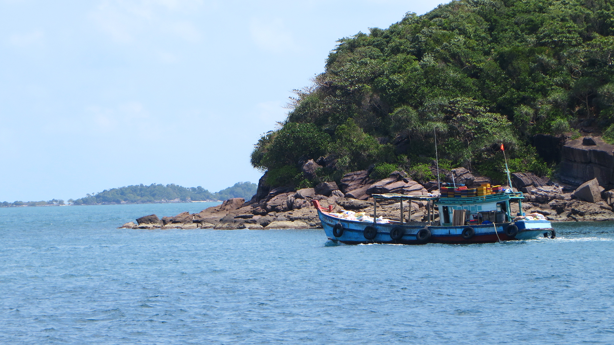
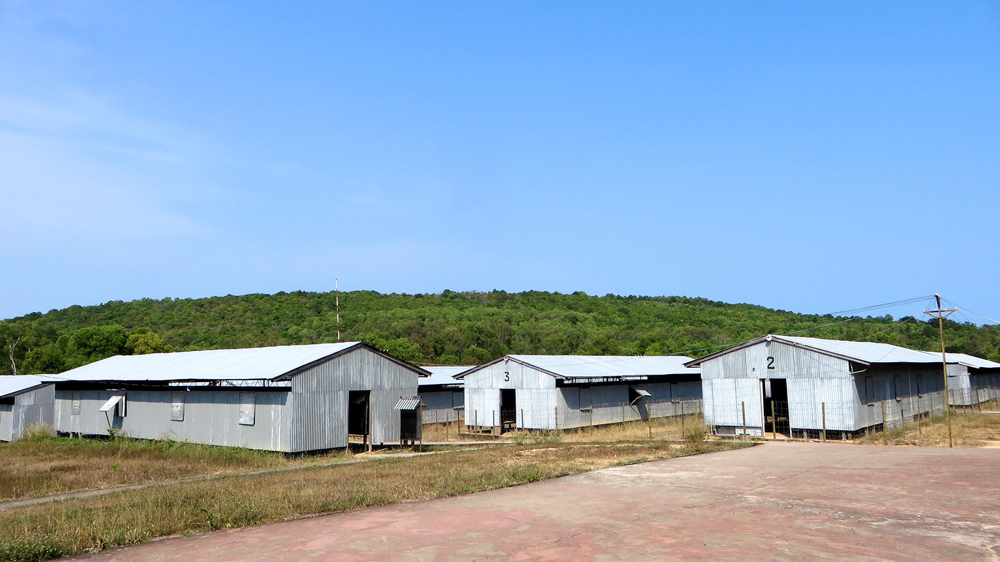
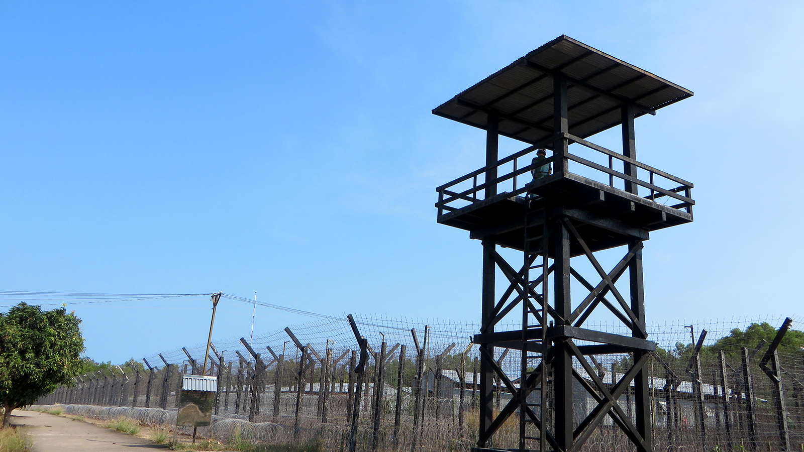
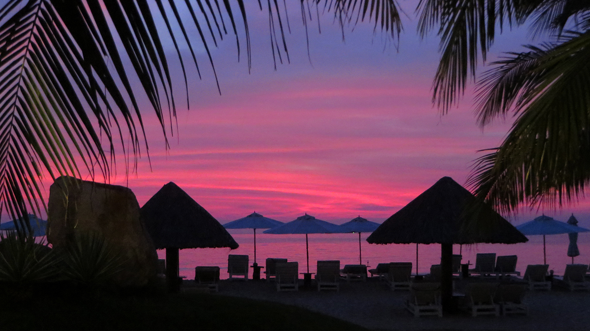
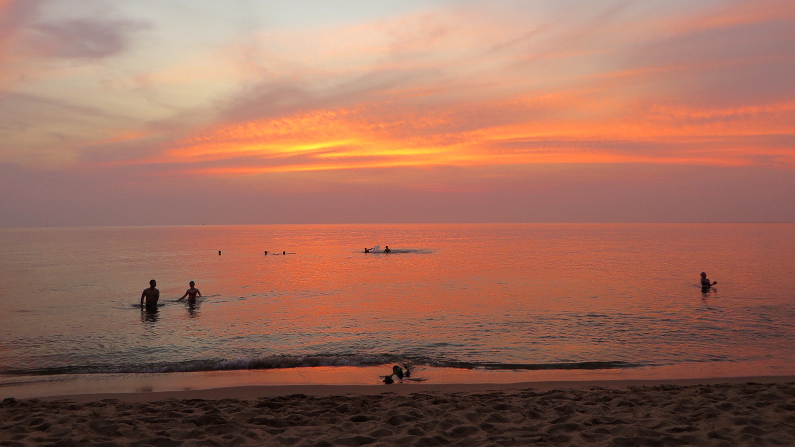
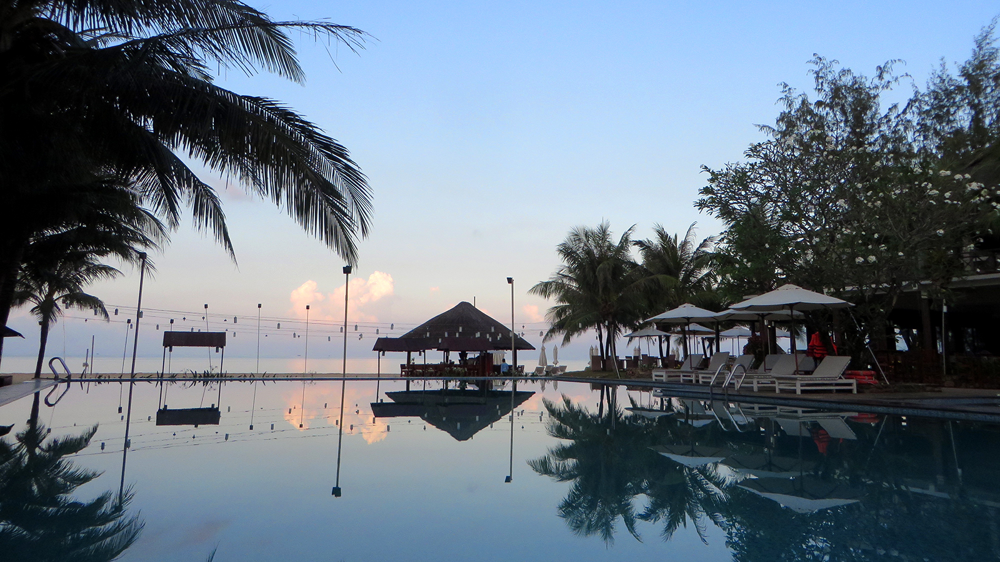

* Werde ein bisschen schräg angeguckt, als ich in meinen staubigen Kleidern an der Reception des 4-Sterne-Resorts erscheine
* Phu Quoc (richtig schreiben)
* Disput mit Kambodascha (territorial)
* History: ehemals brutales Gefängnis (Tiger cages)
* Dreckige Wäsche wird im Zimmer abgeholt und nachmittags gebügelt und gefaltet zurückgebracht
* Man gönnt sich ja sonst nichts
* Phu Quoc: Auf einer Seite touristisch und entwickelt, auf der anderen sehr einfach - Angeblich von einer grossen Firma investiert. Bizarr: Staubige unbefestigte Strasse verwandelt sich abrupt in eine moderne mehrsprurige Schnellstrasse
* Gefängnis erwähnen (einzige Anstrengung)

* Letzte Woche Woche habe ich mich auf der Ferieninsel Phú Quốc 
* von den Reisestrapazen der vergangenen Tage
* wohl nur ein paar Bilder und ganz wenig Text

<figcaption>TODO</figcaption>

<figcaption>TODO</figcaption>

<figcaption>TODO</figcaption>

<figcaption>TODO</figcaption>

<figcaption>TODO</figcaption>

<figcaption>TODO</figcaption>

TODO:
* Write
* Resolve TODOS
* Alles Gegenlesen
* Links prüfen
* Update Map

Nächster Post:
* Kriegsmuseum (Propaganda mal anders, aber seeeeehr mitreissend). Leute haben keine schlechten Gefühle mehr geg.üb. Franzosen/Amis (in meinem Alter) -> Ganz interessant war auch.. (Lee, Familie war auf anderer Seite, aus ihrer Sicht wurde Saigon quasi von den Kommunisten erobert)
* Alle haben mich vor den unfreundlichen Vietnamesen gewarnt, finde sie sind aber sehr freundlich (gibt natürlich auch Unterschiede, wie überall, ist ja klar. Aber halt das Übliche: Touristy spots)
* Kriegsmuseum, Geschichte von Vietnam/Saigon + lokale Schreibweise
* Folgen des Kriegs: Krater, Gebiete in denen immernoch keine Vegetation wächst, viele Menschen mit Behinderungen
* The Nomad Life / Digital Nomads

TODO: Post Nordvietnam (map: airport, 3 hotels im norden, blogpost)
