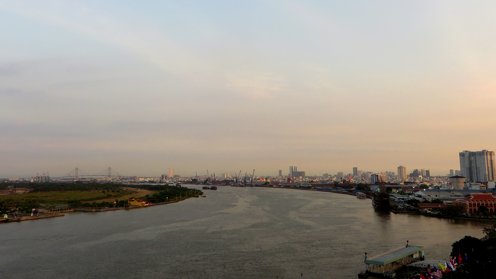

Seit ein paar Tagen bin ich zurück in *Sài Gòn* (so wird die Stadt, die nach dem Ende des
[Vietnamkriegs](https://de.wikipedia.org/wiki/Vietnamkrieg) von den siegreichen Kommunisten zu Ehren des
Nationalisten [Hồ Chí Minh](https://de.wikipedia.org/wiki/H%E1%BB%93_Ch%C3%AD_Minh) umbenannt wurde, von
den Bewohnern hinter vorgehaltener Hand immernoch genannt). Ich sitze gerade am Strassenrand auf einem
lächerlich kleinen Stuhl und schlürfe einen [Cà phê sữa đá](https://en.wikipedia.org/wiki/Vietnamese_iced_coffee).
Dazu geniesse ich ein köstliches Gipfeli, das genauso gut aus Paris stammen könnte (neben Krieg und Elend
haben die französischen Kolonialherren immerhin gute Backrezepte nach Vietnam gebracht) und lese ein paar
Seiten (Huxley's [*Brave New World*](https://en.wikipedia.org/wiki/Brave_New_World) übrigens, falls ihr
mal wieder was gutes lesen möchtet). Insgesamt kein schlechter Start in einen gewöhnlichen Arbeitstag!

<figcaption>Cà phê sữa đá</figcaption>

Nun gilt's aber Ernst – Auf meinem „Töffli“ fahre ich ein paar Strassen durch den extrem chaotischen Berufsverkehr (dessen
Intensität zwischen Sonnenauf- und untergang nur marginal schwankt) bis zu meinem temporären Büro: Einem
Café mit bestem Service und relativ guter Internetverbindung. Nachdem ich mein Motorrad dem Wächter zum
parkieren übergeben habe (wie gesagt, der Service ist erste Sahne), betrete ich das lokal und werde von
der freundlichen Serviertochter empfangen: „Cappucino like every day sir?“ – „Cappucino like every day, cảm
ơn“. Mit einem nachsichtigen Lächeln im Gesicht (mein *cảm ơn*, vietnamesisch für *Danke* war wohl noch
nicht ganz akzentfrei), bereitet sie meinen Cappucino vor.

Ich installiere mich mit Notebook, externer Maus und Tastatur, Kopfhörern und Getränk und beginne meine
Arbeit: Mails- und Chatnachrichten checken, [Pull Requests](https://en.wikipedia.org/wiki/Pull_request)
durchgehn (zur Qualitätskontrolle kontrollieren wir jede Zeile Code, die wir schreiben nach dem
Vier-Augen-Prinzip) und natürlich neue Features für unsere Reiseplattform umsetzen. Der Morgen ist ideal
um ungestört zu arbeiten, denn in der Schweiz ist's momentan noch mitten in der Nacht.

<figcaption>Mobiles Büro</figcaption>

Zum Mittagessen hole ich mir um die Ecke ein [Bánh mì](https://de.wikipedia.org/wiki/B%C3%A1nh_m%C3%AC)
(eine Art kleines Baguette, ein weiteres Vermächtnis der Kolonialherren), das mit allerlei lokalen Köstlichkeiten
gefüllt ist (der Connaisseur würde das wohl [Fusionsküche](https://de.wikipedia.org/wiki/Fusionsk%C3%BCche)
nennen). Danach geht's zurück ins „Büro“. In der Schweiz hat der Arbeitstag mittlerweile begonnen und
so kann ich mich per Chat direkt mit meinen Arbeitskollegen absprechen. Per *Screen Sharing* (wofür die
Internetverbindung, die hier doch um einiges schlechter als in Thailand ist, gerade noch ausreicht)
arbeite ich ausserdem gemeinsam mit meinem Programmier-Kollegen an ein paar besonders kniffligen
Problemen.

<figcaption>Feierabendverkehr</figcaption>

Um 18:00 Uhr mache ich mich auf, um mir beim Coiffeur um die Ecke mal wieder die Haare schneiden zu lassen.
„Coiffeur“ ist allerdings eine Untertreibung dafür, was einem hier geboten wird. Neben dem Haare
schneiden gehören das Bart stutzen und das Nasenhaare zupfen (Aua!) genauso zum Service, wie das Feilen
der Fussnägel und eine auflockernde Schultermassage. Zum Schluss wird mir zudem noch eine Zigarette
angeboten (die ich natürlich ablehne) – Aaah, hier wird der Gentleman also noch als solcher behandelt.

<figcaption>Sonnenuntergang über dem Saigon-Fluss</figcaption>

Nach diesem Rundum-Service fahre ich ein paar Strassen weiter, um mir zum Abendessen ein köstliches
[Bánh xèo](https://en.wikipedia.org/wiki/B%C3%A1nh_x%C3%A8o) zu
gönnen. Ich wähle einen kleinen Umweg, um die grosse Kreuzung zu meinden, an der im Feierabendverkehr
jeweils eine Horde korrupter Verkehrspolizisten lauert (in deren Beuteschema ich als Weisser perfekt
passe).

<figcaption>Strassenszene</figcaption>

Den Abend lasse ich schlussendlich in einer Bar auf dem Dach eines Wolkenkratzers ausklingen. Mein
Blick wandert über die Skyline der pulsierenden Metropole (Ho-Chi-Minh-Stadt hat etwas mehr Einwohner
als die Schweiz) zum Saigon-Fluss. Ein riesiges Frachtschiff macht sich gerade auf ins Südchinesische
Meer. Ich spüre die Sehnsucht, die beim Anblick von Frachtschiffen immer in mir aufkommt. Wo es wohl
hinfährt? Shanghai? Singapur? Hong Kong? Egal – dort möchte ich jedenfalls auch mal hin.

<figcaption>Dunkle Gasse in Ho-Chi-Minh-Stadt</figcaption>
