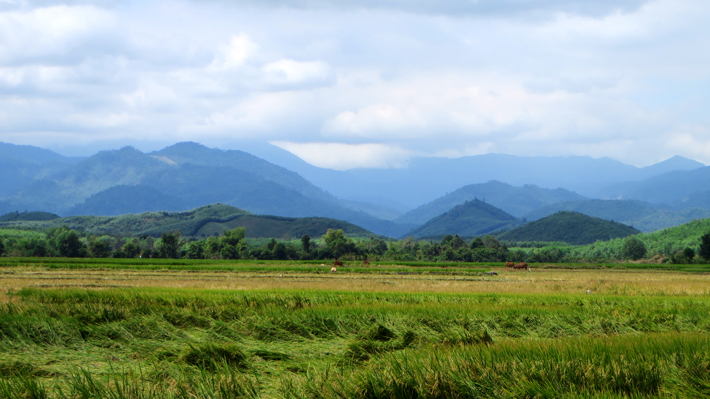

Von Ho-Chi-Minh-Stadt aus habe ich mich per Motorrad aufgemacht Richtung Norden. Dabei habe ich
wunderschöne Gegenden in Süd- und Zentralvietnam durchquert. Die Reise war durchzogen von Schmerzen an
jeglichen Körperstellen und diversen Motorrad-Pannen. Um den Leser nicht mit solchen Details zu langweilen,
lasse ich diesmal aber Bilder sprechen.

<figcaption>Meersalzgewinnung bei La Gi</figcaption>

<figcaption>Wildes Meer bei La Gi</figcaption>

<figcaption>Fischerboote in Phan Thiết</figcaption>

<figcaption>Rote Sanddünen von Mũi Né</figcaption>

<figcaption>Weisse Sanddünen von Mũi Né</figcaption>

<figcaption>Sonnenuntergang in Đà Lạt</figcaption>

<figcaption>Friedhof bei Đà Lạt</figcaption>

<figcaption>Endlose Strasse in Zentralvietnam</figcaption>

<figcaption>Atemberaubende Landschaft in Zentralvietnam</figcaption>

<figcaption>Bergstrasse an der Grenze zu Laos</figcaption>
