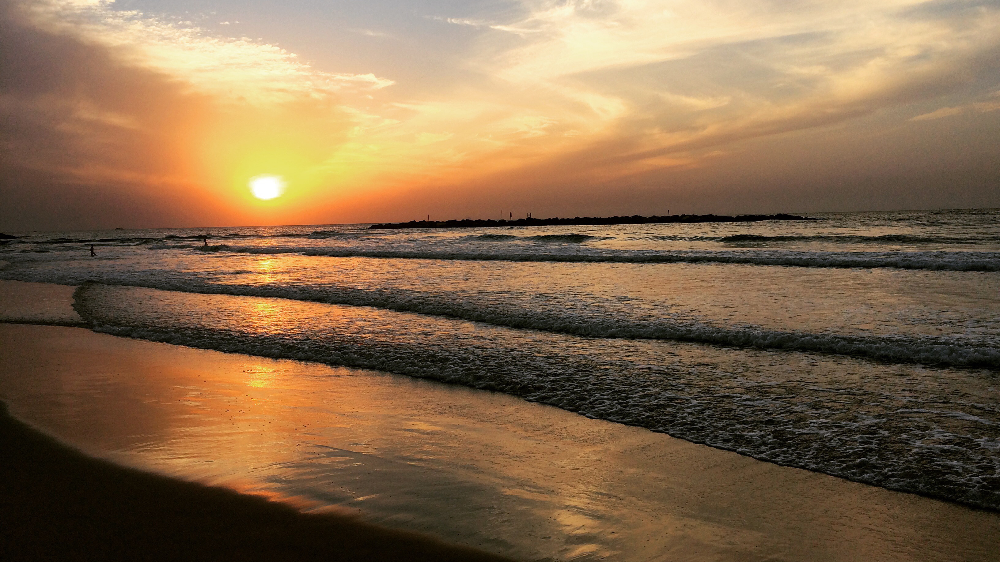

## Sodom und Gomorra

<figcaption>Tel Aviv, von Jaffa aus gesehen</figcaption>

Den grössten Teil meiner Zeit im *heiligen Land* habe ich in der Mittelmeermetropole [Tel Aviv](https://de.wikipedia.org/wiki/Tel_Aviv)
verbracht. Dort habe ich mir für einen Monat ein Büro zum Arbeiten und ein Bett zum Schlafen gemietet. Wenig lässt
einen vermuten, dass hier vor etwas mehr als hundert Jahren hauptsächlich Sand und Steppe zu finden waren.

<figcaption>Sonnenuntergang am Strand von Tel Aviv</figcaption>

Heute wägt man sich in einer Mischung aus Miami und Berlin: Frauen in Minijupes und junge Väter mit Hipsterbart säumen die
Strandpromenade oder schlürfen laktosefreien [Chai Latte](https://en.wikipedia.org/wiki/Latte) in den hippen Cafés.
Es gibt zahlreiche Nachtclubs, in denen international bekannte DJs auftreten. Allerlei Suchtmittel und Prostitution
sind allgegenwärtig, Homosexualität ist öffentlich sichtbar und toleriert – Kein Wunder, wird die Stadt von
ultraorthodoxen Juden als modernes [Sodom und Gomorra](https://de.wikipedia.org/wiki/Sodom_und_Gomorra) bezeichnet.

<figcaption>Hummus, Hummus, Hummus</figcaption>

## Ein Brennpunkt des Israelisch-Palästinensischen Konflikts

[Hebron](https://de.wikipedia.org/wiki/Hebron) ist anders. Hebron ist einer der Brennpunkte des
[Israelisch-Palästinensischen Konflikts](https://de.wikipedia.org/wiki/Israelisch-Pal%C3%A4stinensischer_Konflikt).
Die Stadt befindet sich im von Israel besetzen [Westjordanland](https://de.wikipedia.org/wiki/Westjordanland), auf
dem Gebiet des teilweise anerkannten Staats [Palästina](https://de.wikipedia.org/wiki/Staat_Pal%C3%A4stina). Da
sich in der [Machpela](https://de.wikipedia.org/wiki/Machpela) angeblich die Gräber verschiedener für Gläubige
bedeutender Personen (Abraham, Isaak, Jakob und seine Frauen) befinden, hat Hebron sowohl für Juden, als auch für
Muslime eine grosse religiöse Bedeutung. Für den Grossteil der Geschichte haben hier eine jüdische Minderheit und
eine muslimische Mehrheit einigermassen friedlich nebeneinander gelebt. Dies hat sich mit der Ankunft
jüdischer Siedler in der Region stark geändert: Auf ein [Juden-Massaker](https://de.wikipedia.org/wiki/Massaker_von_Hebron_(1929))
folgten Radikalisierung, mehr jüdische Siedler („Jetzt erst recht!“), weitere Massaker an beiden Parteien, die
Besetzung durch die Armee, Messerattacken gegen israelische Soldaten und ultraorthodoxe Juden, die Einführung des
Militärrechts, Checkpoints, Sicherheitskontrollen und eine Trennung der Stadt in jüdische und muslimische
Quartiere (inklusive Enteignungen und Einschränkung der Bewegungsfreiheit).
Ein umfassendes Bild von Hebron abzugeben ist für mich unmöglich – Dafür habe ich wohl zu wenig Zeit dort
verbracht (worüber ich nicht unfroh bin, denn was man dort sieht und hört ist für ein Schweizer Buebli, der im
Wattebausch-Kokon aufgewachsen ist, einfach nur haarsträubend). Ich versuche jedoch hier ein paar Einblicke und
Gespräche mit Ortsansässigen zusammenzufassen.

<figcaption>Checkpoint zur Altstadt bei Nacht</figcaption>

---
Emanuel ist ein jüdischer Siedler, etwas älter als ich und lebt in einer Siedlung zwischen Hebron und Jerusalem.
Er ist vor ein paar Jahren aus London eingewandert, um „im Land seiner Vorfahren zu leben“. Emanuel ist ein
ziemlich cooler Typ, reisst Witze in seinem britischen Englisch. Er wirkt modern, offen, hat sogar ein paar
palästinensische Freunde. Wenn's aber um die israelische Siedlungspolitik geht, spricht er Klartext: „Es ist
mein Recht, hier zu leben. Juden haben schon immer hier gelebt. Ich würde allerdings von hier wegziehen, wenn es
dafür Frieden geben würde. Aber Frieden wird es niemals geben. Die Araber wollen Israel vernichten.“

---

<figcaption>Die Abdeckung verhindert, dass Flaschen oder Steine auf Passanten geworfen werden</figcaption>

---
Mohammed ist ein Palästinenser in meinem Alter. Obwohl er in seinem Leben das Westjordanland nie verlassen hat,
spricht er fliessend Englisch. Auch er wirkt ziemlich locker. Aber sobald wir auch den Konflikt zu sprechen kommen,
zeigt sich seine Wut. Sie richtet sich einerseits gegen die äusserst umstrittene
[Hamas](https://de.wikipedia.org/wiki/Hamas), die „keinen Frieden will, weil man mit Krieg viel Geld verdienen
kann“ und andererseits gegen die israelische Besetzung: „Das ist unser Land. Sie kommen hierher und sagen uns,
was wir tun dürfen, wo wir wohnen müssen. Wir können uns nicht frei bewegen. Sie behandeln uns wie Terroristen.“

---
Ich albere noch etwas mit Mohammeds Sohn rum. Er ist vier und spielt mit einem Spielzeugauto. Er gibt mir fünf und
lehrt mich das arabische Wort für Auto (*Sajara*). Warum das relevant ist? Einfach als Erinnerung, dass in dieser
Stadt auch viele Kinder aufwachsen. Sie werden dereinst das Erbe dieses Konflikts antreten.

---

<figcaption>Überschwemmung in der Altstadt</figcaption>

Das obige Bild wurde in der Altstadt von Hebron aufgenommen, in einer palästinensischen Marktgasse. Weil es heute
morgen stark geregnet hat, hat sich fast ein Meter Wasser gestaut. Das passiere hier oft im Winter, erzählt mir ein
Anwohner. Das Abwassersystem sei veraltet, die Röhren viel zu klein und verstopft. Die Röhren führten ins
jüdische Viertel, deshalb könnten sie dort nicht hingehen und das Problem beheben. Wie alles hier, wird dies als
absichtliche Provokation aufgefasst. Wie dem auch sei, die Geschäfte bleiben heute jedenfalls geschlossen.

---

<figcaption>Kugelsicheres Glas schützt Betende vor Attentätern</figcaption>

Um die Abrahammoschee zu betreten, muss man durch Sicherheitsschleusen, wie man sie von Flughäfen kennt. Man kriegt
Gänsehaut, wenn man daran denkt, dass hier 1994 während des Morgengebets 29 Menschen von einem jüdischen
Extremisten ermordet wurden. Seither ist das Gebäude durch eine Wand getrennt in einen jüdischen und einen muslimischen
Teil. Von beiden Seiten gibt ein vergittertes Fenster den Blick auf das Grab Abrahams frei. Durch eine Scheibe
aus kugelsicherem Glas sieht man die jüdische Seite.

---
An einem Checkpoint spreche ich einen (etwas gelangweilt dreinschauenden) israelischen Soldaten an. Er ist schwer
bewaffnet und trägt eine kugelsichere Weste. Er erzählt mir,
dass er für je sechs Monate abwechslungsweise eine religiöse Schule besucht und Militärdienst leistet. Ob er keine
Angst habe, frage ich ihn. „Ich bin ein Soldat“. Er muss meinen unzufriedenen Blick gesehen haben, denn er fügt an:
„Siehst du den Pfosten da hinten?“. Ich sehe den Pfosten. „Der ist zwanzig Meter entfernt. Wenn dort ein Terrorist
ein Messer zückt und auf mich zusprintet, habe ich 3 Sekunden Zeit, ihn zu erschiessen“. Mein Blick ist jetzt nicht
mehr unzufrieden. Mein Blick ist jetzt schockiert.

---

<figcaption>Graffito in Hebron</figcaption>

Dieses Graffito habe ich im jüdischen Quartier Hebrons fotografiert: Es zeigt die Scheinheiligkeit auf beiden
Seiten, die zwar einerseits den Wunsch nach Frieden beteuern, andereseits den Konflikt aber mit kleineren und
grösseren Aktionen stetig anheizen. Treffend ist auch die Aktion des Schmierfinks, der mit blauer Farbe versucht
hat zu untermauern, dass „eben nur die anderen scheinheilig sind“.

---
Eine jüdische Siedlerin erzählt mir, dass ihr Grossvater Opfer des Massakers von 1929 wurde und ihr Vater
in seinem Schlafzimmer von einem muslimischen Extremisten ermordet wurde. Sie wünsche sich Frieden, aber werde den
Palästinensern nie Vertrauen können. Etwas abseits spielt ihr Sohn, der im Kindergartenalter sein muss. Er hat die
Geschichte vermutlich schon oft gehört. Was er wohl später damit anfängt?

